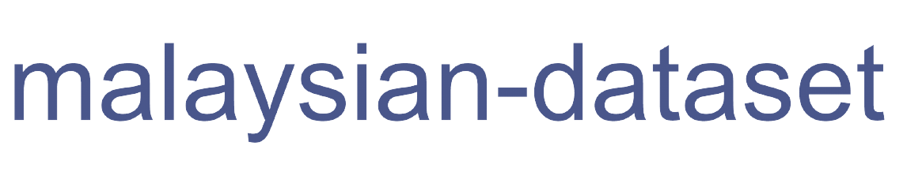

    

  
  
  
  

---

**Malaysian-Dataset**, We gather Malaysian corpus! 

This repository to store corpus for https://github.com/mesolitica/malaya

Speech dataset moved to ttps://github.com/mesolitica/malaya-speech/tree/master/data

**We will keep update this repository overtime**.

## How we gather dataset?

### Social media

1. We catch most of live data from Twitter, Facebook and Instagram using crawlers, So we just search using Elasticsearch query.

### Translation

1. We use Google Translate.
2. We use ChatGPT.
3. We use Malaya translation.

### Semisupervised

#### Teacher-student

1. Supervised small samples and then trained a base model.
2. Trained base model predict larger samples, retrain next student models on high confident labelled data.
3. Repeat.

### LLM

1. Generate using ChatGPT.

## Notes

1. Any missing `mp.py`, get it at https://gist.github.com/huseinzol05/98974ae8c6c7a65d4bc0af9f5003786a
2. Any missing python scripts, please contact me ASAP or create an issue.
3. Please at least email us first before distributing these data. Remember all these hard workings we want to give it for free.
4. What do you see just the data, but nobody can see how much we spent our cost to make it public.

## Suggestion

1. Feel free to contact me to request new dataset.
2. Feel free to open an issue if the link to dataset is forbidden, sometime I forgot to make it open to public.

## Non-commercial Usage

A lot of data here semisupervised / translated / tagged / decoded using third party software, example, Google Translate, Google Speech, so to avoid any future complication, it is better not use this data for commercial purposes but allow for certain research purposes.

## Acknowledgement

Thanks to [Im Big](https://www.facebook.com/imbigofficial/), [LigBlou](https://www.facebook.com/ligblou), [Mesolitica](https://mesolitica.com/) and [KeyReply](https://www.keyreply.com/) for sponsoring AWS Google and private cloud to deploy distributed crawlers.