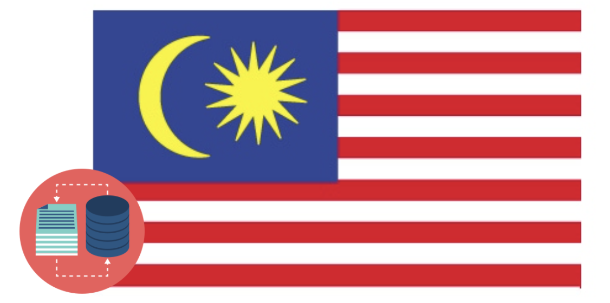

<p align="center">
    <a href="#readme">
        
    </a>
</p>
<p align="center">
  <a href="https://github.com/huseinzol05/Malaya-Dataset/blob/master/LICENSE"></a>
  <a href="https://discord.gg/aNzbnRqt3A"></a>
</p>

---

**Malay-Dataset**, We gather Bahasa Malaysia corpus! 

This repository to store corpus for [huseinzol05/Malaya](https://github.com/huseinzol05/Malaya) and [huseinzol05/Bahasa-NLP-Tensorflow](https://github.com/huseinzol05/Bahasa-NLP-Tensorflow).

Speech dataset moved to [huseinzol05/malaya-speech/data](https://github.com/huseinzol05/malaya-speech/tree/master/data).

Knowledge Graph dataset moved to [huseinzol05/malaya-graph/data](https://github.com/huseinzol05/malaya-graph/tree/master/data).

**We will keep update this repository overtime**.

## How we gather dataset?

1. For news, articles and subtitles, we use crawler, you can get the code from here, [Malaya/crawler](https://github.com/huseinzol05/Malaya/tree/master/misc/crawl).
2. For Bahasa, mostly we use Google Translator, you can get the code from here, [Malaya/translator](https://github.com/huseinzol05/Malaya/tree/master/misc/translator).
3. Using social media, we catch most of live data from Twitter, Facebook and Instagram using crawlers, So we just search using Elasticsearch query.
4. For speech, we recorded using wired microphone attached to Macbook Air 2013 while read some random texts from bahasa wikipedia.
5. We pay some linguists to supervised.
6. Lexicon -> weak learning from translated -> confident learning -> 5 iterations from humans.

## License

Malay-Dataset is available to download for research purposes under a Creative Commons Attribution 4.0 International License.

<a rel="license" href="http://creativecommons.org/licenses/by/4.0/"></a><br />This work is licensed under a <a rel="license" href="http://creativecommons.org/licenses/by/4.0/">Creative Commons Attribution 4.0 International License</a>.

Only data tagged using this  is protected under this license, so feel free to use it for commercial purposes after certain extended permission.

## Non-commercial Usage

A lot of data here semisupervised / translated / tagged / decoded using third party software, example, Google Translate, Google Speech, so to avoid any future complication, it is better not use this data for commercial purposes but allow for certain research purposes.

Only data tagged using this  is protected under these parties.

## Acknowledgement

Thanks to [Im Big](https://www.facebook.com/imbigofficial/), [LigBlou](https://www.facebook.com/ligblou), [Mesolitica](https://mesolitica.com/) and [KeyReply](https://www.keyreply.com/) for sponsoring AWS Google and private cloud to deploy distributed crawlers.


## Table of contents
  * [Chatbot](#chatbot)
    * [Wiki Wizard](#wiki-wizard)
    * [ConvAI2](#convai2)
    * [Blended Skill Talk](#blended-skill-talk)
    * [DialoGPT](#dialogpt)
    * [Taskmaster](#taskmaster)
  * [Corpus](#corpus)
    * [Audience Nationality](#audience-nationality)
    * [Translated Emotion](#Translated-Emotion)
    * [Twitter Emotion](#Twitter-Emotion)
    * [Gender](#gender)
    * [Insincere question](#insincere-question)
    * [Irony](#irony)
    * [Language Detection](#language-detection)
    * [Malaysia Entities](#malaysia-entities)
    * [Malaysia Topics](#malaysia-topics)
    * [Political landscape](#political-landscape)
    * [Sarcastic news-headline](#sarcastic-news-headline)
    * [Subjectivity](#subjectivity)
    * [Toxicity-small](#toxicity-small)
    * [Toxicity-large](#toxicity-large)
    * [NSFW](#nsfw)
    * [The Pile](#the-pile)
    * [goemotions](#goemotions)
  * [Crawl](#crawl)
    * [Foodpanda](#foodpanda)
    * [Klook](#klook)
    * [IIUM-Confession](#iium-confession)
    * [Wattpad](#wattpad)
    * [Academia PDF](#academia-pdf)
    * [ticket2u](#ticket2u)
    * [Iproperty](#iproperty)
  * [Dictionary](#dictionary)
    * [73k English-Malay](#73k-english-malay)
    * [200k English-Malay](#200k-english-malay)
    * [90k synonym](#90k-synonym)
    * [Dictionary, 24550 unique words](#dictionary-24550-unique-words)
    * [Dialect](#dialect)
    * [Ngrams](#ngrams)
    * [7k antonym](#7k-antonym)
  * [Document Ranking](#document-ranking)
    * [MSMARCO](#msmarco)
  * [Dumping](#dumping)
    * [Karangan sekolah](#karangan-sekolah)
    * [Wikipedia](#wikipedia-1)
    * [Instagram](#instagram)
    * [Twitter](#twitter)
    * [Public news](#public-news)
    * [Parliament](#parliament)
    * [Singlish text](#singlish-text)
    * [Singapore news](#singapore-news)
    * [Subtitle](#subtitle)
    * [Common-crawl](#common-crawl)
    * [Clean](#clean)
    * [Reddit](#reddit)
  * [Generative](#generative)
    * [CommonGen](#commongen)
  * [Keyphrase](#keyphrase)
    * [kdd](#kdd)
    * [WWW](#www)
    * [OpenKP](#openkp)
    * [KPTimes](#kptimes)
    * [Twitter Bahasa](#twitter-bahasa)
  * [Lexicon](#lexicon)
    * [Sentiment](#sentiment)
    * [Emotion](#emotion)
  * [News](#news)
    * [Fake News](#fake-news)
    * [Crawled News](#crawled-news)
    * [30k News](#30k-news)
    * [Articles](#articles)
    * [Headline](#headline)
  * [Natural Language Query](#natural-language-query)
    * [SPIDER](#spider)
    * [COSQL](#cosql)
    * [SPARC](#sparc)
  * [Normalization](#normalization)
    * [IIUM](#iium)
    * [Twitter](#twitter-1)
    * [Normalize](#normalize)
    * [Stemmer](#stemmer)
  * [Optical Character Recognition](#optical-character-recognition)
    * [Malay-to-Jawi](#malay-to-jawi)
    * [Malay handwriting (Satisfy-Regular)](#malay-handwriting-satisfy-regular)
  * [Paraphrase](#paraphrase)
    * [General](#general)
    * [Funpedia](#funpedia)
    * [ParaSCI](#parasci)
    * [PAWS](#paws)
    * [Semisupervised Academia](#semisupervised-academia)
    * [Semisupervised News](#semisupervised-news)
    * [Semisupervised Wikipedia](#semisupervised-wikipedia)
  * [Parsing](#parsing)
    * [constituency](#constituency)
    * [dependency](#dependency)
  * [Question-Answer](#question-answer)
    * [General](#general)
    * [SQUAD](#squad)
    * [Natural Questions](#Natural-Questions)
  * [Segmentation](#segmentation)
  * [Sentiment](#sentiment-1)
    * [Local News](#local-news)
    * [Twitter](#twitter-2)
    * [Translated Twitter](#Translated-Twitter)
    * [Translated Multidomain](#Translated-Multidomain)
    * [Translated Polarity](#Translated-Polarity)
  * [Spelling Correction](#spelling-correction)
    * [Neuspell](#neuspell)
  * [Summarization](#summarization)
    * [CNN News](#cnn-news)
    * [Gigawords](#gigawords)
    * [Multinews](#multinews)
    * [Semisupervised](#semisupervised)
    * [Sentiment](#sentiment-2)
  * [Tagging](#tagging)
    * [Part-of-Speech](#part-of-speech)
    * [Entities](#entities-json)
    * [Semisupervised Entities Parliament](#semisupervised-entities-parliament)
  * [Text-similarity](#text-similarity)
    * [Quora](#quora)
    * [SNLI](#snli)
    * [MNLI](#mnli)
  * [Translation](#translation)
    * [IIUM-Confession](#iium-confession-1)
    * [Malay-English](#malay-english)
    * [Opus](#opus)
    * [Parliament](#parliament-1)
    * [Local Movies Subtitles](#local-movies-subtitles)
    * [English News](#english-news)
    * [EN-MS Alignment](#en-ms-alignment)
    * [MS-EN Alignment](#ms-en-alignment)
  * [Suggestion](#suggestion)
  * [Citation](#citation)
  * [Donation](#donation)

## [Chatbot](chatbot)

#### [Blended Skill Talk](chatbot/blended-skill-talk)

Total size: 31.2 MB

```bibtex
@article{DBLP:journals/corr/abs-2004-08449,
  author    = {Eric Michael Smith and
               Mary Williamson and
               Kurt Shuster and
               Jason Weston and
               Y{-}Lan Boureau},
  title     = {Can You Put it All Together: Evaluating Conversational Agents' Ability
               to Blend Skills},
  journal   = {CoRR},
  volume    = {abs/2004.08449},
  year      = {2020},
  url       = {https://arxiv.org/abs/2004.08449},
  archivePrefix = {arXiv},
  eprint    = {2004.08449},
  timestamp = {Sat, 23 Jan 2021 01:20:50 +0100},
  biburl    = {https://dblp.org/rec/journals/corr/abs-2004-08449.bib},
  bibsource = {dblp computer science bibliography, https://dblp.org}
}
```


#### [ConvAI2](chatbot/convai2)

Total size: 127.9 MB

```bibtex
@article{DBLP:journals/corr/abs-1902-00098,
  author    = {Emily Dinan and
               Varvara Logacheva and
               Valentin Malykh and
               Alexander H. Miller and
               Kurt Shuster and
               Jack Urbanek and
               Douwe Kiela and
               Arthur Szlam and
               Iulian Serban and
               Ryan Lowe and
               Shrimai Prabhumoye and
               Alan W. Black and
               Alexander I. Rudnicky and
               Jason Williams and
               Joelle Pineau and
               Mikhail S. Burtsev and
               Jason Weston},
  title     = {The Second Conversational Intelligence Challenge (ConvAI2)},
  journal   = {CoRR},
  volume    = {abs/1902.00098},
  year      = {2019},
  url       = {http://arxiv.org/abs/1902.00098},
  archivePrefix = {arXiv},
  eprint    = {1902.00098},
  timestamp = {Sat, 23 Jan 2021 01:11:58 +0100},
  biburl    = {https://dblp.org/rec/journals/corr/abs-1902-00098.bib},
  bibsource = {dblp computer science bibliography, https://dblp.org}
}
```


#### [Wiki Wizard](chatbot/wiki-wizard)

Total size: 275.0 MB

```bibtex
@article{DBLP:journals/corr/abs-1811-01241,
  author    = {Emily Dinan and
               Stephen Roller and
               Kurt Shuster and
               Angela Fan and
               Michael Auli and
               Jason Weston},
  title     = {Wizard of Wikipedia: Knowledge-Powered Conversational agents},
  journal   = {CoRR},
  volume    = {abs/1811.01241},
  year      = {2018},
  url       = {http://arxiv.org/abs/1811.01241},
  archivePrefix = {arXiv},
  eprint    = {1811.01241},
  timestamp = {Sat, 23 Jan 2021 01:19:39 +0100},
  biburl    = {https://dblp.org/rec/journals/corr/abs-1811-01241.bib},
  bibsource = {dblp computer science bibliography, https://dblp.org}
}
```


#### [DialoGPT](chatbot/dialogpt)

Total size: 5.6 GB

```bibtex
@article{DBLP:journals/corr/abs-1911-00536,
  author    = {Yizhe Zhang and
               Siqi Sun and
               Michel Galley and
               Yen{-}Chun Chen and
               Chris Brockett and
               Xiang Gao and
               Jianfeng Gao and
               Jingjing Liu and
               Bill Dolan},
  title     = {DialoGPT: Large-Scale Generative Pre-training for Conversational Response
               Generation},
  journal   = {CoRR},
  volume    = {abs/1911.00536},
  year      = {2019},
  url       = {http://arxiv.org/abs/1911.00536},
  archivePrefix = {arXiv},
  eprint    = {1911.00536},
  timestamp = {Tue, 05 Jan 2021 15:06:52 +0100},
  biburl    = {https://dblp.org/rec/journals/corr/abs-1911-00536.bib},
  bibsource = {dblp computer science bibliography, https://dblp.org}
}
```


#### [Taskmaster](chatbot/taskmaster)

Total size: 94 MB

```bibtex
@inproceedings{48484,
title	= {Taskmaster-1: Toward a Realistic and Diverse Dialog Dataset},
author	= {Bill Byrne and Karthik Krishnamoorthi and Chinnadhurai Sankar and Arvind Neelakantan and Daniel Duckworth and Semih Yavuz and Ben Goodrich and Amit Dubey and Kyu-Young Kim and Andy Cedilnik},
year	= {2019}
}
```


## [Corpus](corpus)

#### [Audience Nationality](corpus/audience)

Total size: 246 KB

1. constituency
2. national

```bibtex
@misc{eight_2016, title={Political Social Media Posts}, url={https://www.kaggle.com/crowdflower/political-social-media-posts}, journal={Kaggle}, author={Eight, Figure}, year={2016}, month={Nov}}
```


#### [Twitter Emotion](corpus/emotion)

Total size: 27.4 MB

1. Anger, 108813 rows
2. Fear, 20316 rows
3. Happy, 30962 rows
4. love, 20783 rows
5. Sadness, 26468 rows
6. Surprise, 13107 rows

```bibtex
@misc{Malay-Dataset, We gather Bahasa Malaysia corpus!, Semi-Supervised Emotion dataset,
  author = {Husein, Zolkepli},
  title = {Malay-Dataset},
  year = {2018},
  publisher = {GitHub},
  journal = {GitHub repository},
  howpublished = {\url{https://github.com/huseinzol05/malay-dataset/tree/master/corpus/emotion}}
}
```


#### [Gender](corpus/gender)

Total size: 2.2 MB

1. Unknown
2. Male
3. Female
4. Brand

```bibtex
@misc{eight_2016, title={Twitter User Gender Classification}, url={https://www.kaggle.com/crowdflower/twitter-user-gender-classification}, journal={Kaggle}, author={Eight, Figure}, year={2016}, month={Nov}}
```

Reference: https://www.kaggle.com/crowdflower/twitter-user-gender-classification


#### [Insincere question](corpus/insincere-question)

Total size: 60.4 MB

1. Negative
2. Positive

```bibtex
@misc{kaggle, title={Quora Insincere Questions Classification}, url={https://www.kaggle.com/c/quora-insincere-questions-classification}, journal={Kaggle}}
```


#### [Irony](corpus/irony)

Total size: 465 KB

1. Positive
2. Negative

```bibtex
@misc{tatman_2017, title={Ironic Corpus}, url={https://www.kaggle.com/rtatman/ironic-corpus}, journal={Kaggle}, author={Tatman, Rachael}, year={2017}, month={Jul}}
```


#### [Language-detection](corpus/language-detection)

1. english
2. malay
3. indonesia
4. rojak
5. manglish
6. others

sublanguages,

1. malay
2. kedah
3. johor
4. melaka
5. terengganu
6. sarawak
7. negeri-sembilan
8. kelantan
9. pahang
10. perak
11. sabah

```bibtex
@misc{Malay-Dataset, We gather Bahasa Malaysia corpus!, Lexicon based Language Detection dataset,
  author = {Husein, Zolkepli},
  title = {Malay-Dataset},
  year = {2018},
  publisher = {GitHub},
  journal = {GitHub repository},
  howpublished = {\url{https://github.com/huseinzol05/malay-dataset/tree/master/corpus/language-detection}}
}
```


#### [Malaysia-entities](corpus/malaysia-entities)

Social media texts related to Malaysia entities.

Total size: 190.1 MB

```bibtex
@misc{Malay-Dataset, We gather Bahasa Malaysia corpus!, Lexicon based Malaysia Entities dataset,
  author = {Husein, Zolkepli},
  title = {Malay-Dataset},
  year = {2018},
  publisher = {GitHub},
  journal = {GitHub repository},
  howpublished = {\url{https://github.com/huseinzol05/malay-dataset/tree/master/corpus/malaysia-entities}}
}
```


<details><summary>Complete list (210 entities)</summary>

1. mahathir
2. anwar ibrahim
3. najib razak
4. pakatan harapan
5. syed saddiq
6. parti keadilan rakyat
7. umno
8. barisan nasional
9. parti islam semalaysia
10. nurul izzah
11. tunku ismail idris
12. mca
13. democratic action party
14. parti amanah
15. ppbm
16. mic
17. tun daim zainuddin
18. datuk seri abdul hadi awang
19. majlis pakatan harapan
20. wan azizah
21. parti pribumi bersatu malaysia
22. datuk seri azmin ali
23. datuk johari abdul
24. tengku razaleigh hamzah
25. tan sri dr rais yatim
26. rafizi ramli
27. bersatu
28. bernama
29. donald trump
30. perkasa
31. tan sri mokhzani mahathir
32. rais yatim
33. anthony loke siew fook
34. rosmah mansur
35. arul kanda
36. zeti aziz
37. robert kuok
38. hassan merican
39. ks jomo
40. jho low
41. kadir jasin
42. zakir naik
43. bung mokhtar
44. shafie apdal
45. ariff md yusof
46. felda
47. dato vida
48. jabatan perancangan bandar desa
49. jabatan perdana menteri malaysia
50. kementerian kewangan malaysia
51. kementerian dalam negeri malaysia
52. kementerian perdagangan dalam negeri hal ehwal pengguna malaysia
53. kementerian luar negeri malaysia
54. kementerian pertahanan malaysia
55. kementerian pendidikan malaysia
56. kementerian pembangunan luar bandar
57. kementerian kerja raya malaysia
58. kementerian kesihatan malaysia
59. kementerian komunikasi multimedia malaysia
60. kementerian perumahan kerajaan tempatan malaysia
61. kementerian pelancongan kebudayaan malaysia
62. kementerian pengangkutan malaysia
63. kementerian pembangunan wanita keluarga masyarakat malaysia
64. kementerian pertanian industri asas tani
65. kementerian perusahaan perladangan komoditi
66. kementerian perdagangan antarabangsa industri
67. kementerian sains teknologi inovasi malaysia
68. kementerian sumber manusia malaysia
69. kementerian sumber asli alam sekitar malaysia
70. kementerian wilayah persekutuan malaysia
71. kementerian tenaga teknologi hijau air malaysia
72. jabatan perkhidmatan awam malaysia
73. jabatan kemajuan islam (jakim) department of islamic development
74. jabatan parlimen malaysia
75. agensi kelayakan malaysia
76. agensi penguatkuasaan maritim malaysia
77. bahagian istiadat urusetia persidangan antarabangsa
78. bahagian hal ehwal undang-undang
79. bahagian kabinet perlembangan perhubungan antara kerajaan
80. bahagian kemajuan wilayah persekutuan perancangan lembah klang
81. bahagian keselamatan negara
82. bahagian pengurusan hartanah
83. bahagian pengurusan perkhidmatan sumber manusia
84. bahagian penyelidikan
85. biro bantuan guaman
86. biro pengaduan awam
87. biro tatanegara
88. istana negara
89. institut kefahaman islam malaysia
90. institut latihan kehakiman perundangan
91. pejabat ketua setiausaha negara
92. pejabat perdana menteri
93. jabatan peguam negara
94. majlis agama islam wilayah persekutuan
95. masjid negara
96. pejabat ketua pegawai keselamatan kerajaan malaysia
97. pejabat setiausaha persekutuan sabah
98. perpustakaan kuala lumpur
99. pejabat setiausaha persekutuan sarawak
100. lembaga tabung haji
101. penasihat sains
102. jabatan audit negara malaysia
103. jabatan pertahanan awam malaysia
104. suruhanjaya pengankutan awam darat
105. perbendaharaan malaysia
106. majlis tindakan ekonomik negara
107. jabatan perangkaan (jp) department of statistics
108. polis diraja malaysia
109. ikatan relawan rakyat malaysia
110. jabatan penjara malaysia
111. jabatan pendaftaran negara malaysia
112. lembaga penapisan filem
113. jabatan imigresen malaysia
114. suruhanjaya syarikat malaysia
115. suruhanjaya koperasi malaysia
116. perbadanan harta intelek malaysia
117. bank kerjasama rakyat malaysia
118. perbadanan nasional berhad
119. maktab koperasi malaysia
120. suruhanjaya persaingan malaysia
121. institut diplomasi hal ehwal luar negeri
122. angkatan tentera malaysia
123. tentera darat malaysia
124. tentera udara diraja malaysia
125. tentera laut diraja malaysia
126. program latihan khidmat negara
127. dewan bahasa pustaka
128. institut pendidikan guru malaysia
129. perbadanan tabung pendidikan tinggi nasional
130. institut terjemahan negara malaysia
131. kejora
132. felcra
133. risda
134. jabatan kerja raya malaysia
135. lembaga lebuhraya malaysia
136. lembaga jurutera malaysia
137. lembaga pembangunan industri pembinaan
138. institut jantung negara
139. klinik 1malaysia
140. insitut kanser negara
141. radio televisyen malaysia
142. suruhanjaya komunikasi multimedia malaysia
143. jabatan penerangan malaysia
144. jabatan perancangan bandar desa semenanjung malaysia
145. jabatan bomba penyelamat malaysia
146. jabatan perumahan negara
147. jabatan kerajaan tempatan
148. jabatan landskap negara
149. jabatan pengurusan sisa pepejal negara
150. tribunal perumahan pengurusan strata
151. perbadanan pengurusan sisa pepejal pembersihan awam
152. jabatan pelancongan malaysia
153. jabatan pengangkutan jalan
154. jabatan penerbangan awam
155. lembaga pelabuhan klang
156. jabatan laut malaysia
157. jabatan keselamatan jalan raya
158. lembaga pelabuhan kuantan
159. lembaga pelabuhan johor
160. lembaga pelabuhan pulau pinang
161. jabatan kebajikan masyarakat malaysia
162. institut penyelidikan kemajuan pertanian malaysia
163. lembaga kemajuan ikan malaysia
164. lembaga pemasaran pertanian persekutuan
165. jabatan pertanian malaysia
166. lembaga pertubuhan peladang
167. lembaga kemajuan pertanian kemubu
168. lembaga kemajuan pertanian muda
169. jabatan perikanan
170. jabatan perkhidmatan veterinar
171. lembaga perindustrian nanas malaysia
172. tabung ekonomi kumpulan usaha niaga
173. bank pertanian
174. lembaga minyak sawit malaysia
175. lembaga pembangunan pelaburan malaysia
176. agensi nuklear malaysia
177. institut penyelidikan teknologi nuklear malaysia
178. pusat sains negara
179. jabatan kimia malaysia
180. jabatan meteorologi malaysia
181. jabatan perkhidmatan awam
182. institut tadbiran awam negara
183. jabatan agama islam wilayah persekutuan
184. jabatan tenaga kerja semenanjung malaysia
185. jabatan alam sekitar
186. jabatan pengairan saliran
187. jabatan tanah galian wilayah persekutuan
188. jabatan perlindungan hidupan liar taman negara
189. dewan bandaraya kuala lumpur
190. perbadanan putrajaya
191. perbadanan labuan
192. jabatan bekalan air
193. jabatan perkhidmatan pembetungan
194. suruhanjaya tenaga
195. suruhanjaya perkhidmatan air negara
196. malaysian green technology corporation
197. yayasan hijau malaysia
198. mahkamah persekutuan
199. mahkamah syariah wilayah persekutuan
200. suruhanjaya perdagangan komoditi
201. suruhanjaya perkhidmatan awam
202. suruhanjaya perkhidmatan pendidikan
203. suruhanjaya pilihan raya
204. suruhanjaya pencegahan rasuah malaysia
205. tribunal perkhidmatan awam
206. unit khas teknologi tinggi
207. unit pemodenan tadbiran perancangan pengurusan malaysia
208. unit perancang ekonomi
209. unit penyelarasan pelaksanaan
210. urusetia persidangan antarabangsa protokol

</details>

#### [Malaysia Topics](corpus/malaysia-topics)

Social media texts related to Malaysia topics.

Total size: 322.4 MB

```bibtex
@misc{Malay-Dataset, We gather Bahasa Malaysia corpus!, Lexicon based Malaysia Topics dataset,
  author = {Husein, Zolkepli},
  title = {Malay-Dataset},
  year = {2018},
  publisher = {GitHub},
  journal = {GitHub repository},
  howpublished = {\url{https://github.com/huseinzol05/malay-dataset/tree/master/corpus/malaysia-topics}}
}
```


<details><summary>Complete list (249 topics)</summary>

1. ganja
2. orang asli
3. kaum cina
4. k-pop
5. kaum india
6. pos laju
7. hari raya aidilfitri
8. hari raya aidiladha
9. syarikat permulaan
10. isu tanah
11. kaum melayu
12. facebook
13. keluar parti
14. sabotaj parti
15. kotak undi
16. humanoid
17. kemalangan penumpang cedera
18. kemalangan maut
19. individu penjara
20. kes rogol
21. kes cabul
22. kes rompakan
23. kes ragut
24. cambridge analytica
25. kokain
26. bebas tahanan
27. sosial media
28. twitter
29. instagram
30. mati dipukul
31. pengedar dadah
32. kematian wabak
33. letupan bom
34. isu dadah
35. isu bmf
36. isu diesel
37. isu china
38. isu saudi arabia
39. unifi
40. piala thomas
41. fifa
42. bahasa pengaturcaraan
43. baling botol
44. perkahwinan kanak-kanak
45. produk berbahaya
46. musim durian
47. world cup
48. motogp
49. euro 2020
50. ask me a question
51. thai cave
52. racist
53. bola sepak
54. hockey
55. sepak takraw
56. reformasi
57. deepavali
58. chinese new year
59. lazada sells
60. shopee sells
61. e-sport
62. valve corporation
63. dota2
64. counter strike global-offensive
65. asean football organization
66. blackpink
67. kecurian kereta
68. kecurian motosikal
69. youtube rewind
70. pewdiepie
71. isu tiket
72. kuota haji
73. tsunami
74. kes lemas
75. kes buang bayi
76. kes pecah rumah
77. paedophilia
78. kes luar nikah
79. kes tangkap basah
80. kes bawah umur
81. pdrm
82. 1mdb
83. gst
84. sst
85. tiga penjuru
86. pilihan raya umum
87. pilihan raya kecil
88. pusat daerah mangundi
89. masalah air
90. rumah mampu milik
91. pendidikan
92. sekolah
93. universiti
94. maktab rendah sains mara
95. kesihatan
96. hutang negara
97. ekonomi
98. sosial
99. menteri besar kedah
100. menteri besar perak
101. menteri besar perlis
102. menteri besar selangor
103. menteri besar johor
104. menteri besar kelantan
105. menteri besar terengganu
106. menteri besar negeri sembilan
107. felda
108. kwsp
109. sosco
110. bank malaysia
111. bank negara
112. perdana menteri
113. timbalan perdana menteri
114. menteri dalam negeri
115. menteri kewangan
116. menteri pertahanan
117. menteri belia dan sukan
118. majlis penasihat
119. skim peduli sihat
120. ptptn
121. projek mega
122. gaji minimum
123. menyiasat skandal
124. highway tol
125. tabung haji
126. tentera malaysia
127. infrastruktur
128. kos sara hidup
129. pengangkutan awam
130. perkhidmatan awam
131. isu wanita
132. survei institut darul ehsan
133. inisiatif peduli rakyat
134. teknologi
135. internet
136. kecerdasan buatan
137. ahli dewan undangan negeri
138. suruhanjaya pilihan raya malaysia
139. kertas undi
140. akta pilihan raya
141. undi pos
142. undi rosak
143. harga minyak
144. petrol
145. subsidi kerajaan
146. mh370
147. gaji menteri
148. jabatan bubar
149. telekom malaysia
150. agama
151. lgbt
152. agama islam
153. masyarakat
154. liberalisme
155. kapitalisme
156. idealogi
157. parlimen
158. pusat transformasi bandar
159. institut diraja
160. tsunami fitnah
161. makro-ekonomi
162. mikro-ekonomi
163. pasaran saham malaysia
164. pendapatan negara
165. nilai ringgit jatuh
166. gaji median
167. bursa malaysia
168. malaysia baru
169. keluar parlimen
170. dewan rakyat
171. tabung harapan
172. isu singapura
173. isu rohingya
174. isu syria
175. malaysia-indonesia
176. isu gaza
177. isu palestin
178. isu yaman
179. harimau malaya
180. isu kuil
181. isu lynas
182. isu masjid
183. isu sosma
184. isu ecrl
185. royalti minyak
186. kes rasuah
187. kewangan dan perniagaan
188. saham dan komoditi
189. isu kerugian
190. bumiputera
191. alam sekitar
192. isu kemiskinan
193. sumber asli
194. pertanian malaysia
195. pertanian durian
196. pertanian padi
197. pertanian getah
198. pertanian kelapa sawit
199. pertanian pisang
200. pertanian nenas
201. akuakultur malaysia
202. hortikultur malaysia
203. icerd
204. yang di-pertuan agong
205. perlembagaan malaysia
206. malaysia airlines
207. malaysia airport
208. kuala lumpur international airport
209. malacca airport
210. bintulu airport
211. kota kinabalu airport
212. kuching airport
213. labuan airport
214. lahad datu airport
215. langkawi airport
216. limbang airport
217. miri airport
218. penang airport
219. sandakan airport
220. sibu airport
221. sultan abdul halim airport
222. sultan haji ahmad shah airport
223. sultan azlan shah airport
224. sultan ismail petra airport
225. sultan mahmud airport
226. tawau airport
227. tioman airport
228. anggota bomba
229. angkatan tentera darat
230. angkatan tentera laut
231. angkatan tentera udara
232. anggota ambulans
233. anggota polis
234. perkhidmatan kehakiman
235. perkhidmatan am persekutuan
236. industri 4.0
237. kumpulan pengganas tempatan
238. kumpulan pengganas asing
239. sultan selangor
240. sultan kedah
241. sultan kelantan
242. sultan perlis
243. sultan johor
244. sultan negeri sembilan
245. sultan terengganu
246. pemilihan agong
247. isu plastik
248. gejala sosial
249. isytihar darurat

</details>

#### [Sarcastic news-headline](corpus/sarcastic-news-headline)

Total size: 1.78 MB

1. Positive
2. Negative

```bibtex
@misc{misra_2019, title={News Headlines Dataset For Sarcasm Detection}, url={https://www.kaggle.com/rmisra/news-headlines-dataset-for-sarcasm-detection}, journal={Kaggle}, author={Misra, Rishabh}, year={2019}, month={Jul}}
```


#### [Subjectivity](corpus/subjectivity)

Total size: 1.4 MB

1. Positive
2. Negative

```bibtex
@InProceedings{Pang+Lee:04a,
  author =       {Bo Pang and Lillian Lee},
  title =        {A Sentimental Education: Sentiment Analysis Using Subjectivity Summarization Based on Minimum Cuts},
  booktitle =    "Proceedings of the ACL",
  year =         2004
}
```


#### [Toxicity-small](corpus/toxicity-small)

Total size: 69 MB

Toxicity-small is multilabels and multiclasses, prefer to use sigmoid / logistic.

1. toxic
2. severe toxic
3. obscene
4. threat
5. insult
6. identity hate

```bibtex
@misc{kaggle, title={Toxic Comment Classification Challenge}, url={https://www.kaggle.com/c/jigsaw-toxic-comment-classification-challenge}, journal={Kaggle}}
```


#### [Toxicity-large](corpus/toxicity-large)

Total size: 640 MB

Toxicity-large is multilabels and multiclasses, prefer to use sigmoid / logistic.

1. severe toxic
2. obscene
3. identity attack
4. insult
5. threat
6. asian
7. atheist
8. bisexual
9. black
10. buddhist
11. christian
12. female
13. heterosexual
14. hindu
15. homosexual, gay or lesbian
16. intellectual or learning disability
17. jewish
18. latino
19. male
20. muslim
21. other disability
22. other gender
23. other race or ethnicity
24. other religion
25. other sexual orientation
26. physical disability
27. psychiatric or mental illness
28. transgender
29. white
30. malay
31. chinese

```bibtex
@misc{kaggle, title={Jigsaw Multilingual Toxic Comment Classification}, url={https://www.kaggle.com/c/jigsaw-multilingual-toxic-comment-classification}, journal={Kaggle}}
```


But label 14, 29, 30, 31 under  .

#### [Political landscape](corpus/political-landscape)

Total size: 2 MB

1. Kerajaan (BN)
2. Pembangkang (PAS, DAP, PKR)

```bibtex
@misc{Malay-Dataset, We gather Bahasa Malaysia corpus!, Lexicon based Political Landscape Detection dataset,
  author = {Husein, Zolkepli},
  title = {Malay-Dataset},
  year = {2018},
  publisher = {GitHub},
  journal = {GitHub repository},
  howpublished = {\url{https://github.com/huseinzol05/malay-dataset/tree/master/corpus/political-landscape}}
}
```


#### [NSFW](corpus/nsfw)

Total size: 85.9 MB

1. Sex, 1383577 texts
2. Gambling, 256168 texts
3. negative, [dumping/common-crawl](#common-crawl)

```bibtex
@misc{Malay-Dataset, We gather Bahasa Malaysia corpus!, Lexicon based NSFW Detection dataset,
  author = {Husein, Zolkepli},
  title = {Malay-Dataset},
  year = {2018},
  publisher = {GitHub},
  journal = {GitHub repository},
  howpublished = {\url{https://github.com/huseinzol05/malay-dataset/tree/master/corpus/nsfw}}
}
```


#### [The Pile](corpus/pile)

Total size: 22.7 GB

```bibtex
@article{DBLP:journals/corr/abs-2101-00027,
  author    = {Leo Gao and
               Stella Biderman and
               Sid Black and
               Laurence Golding and
               Travis Hoppe and
               Charles Foster and
               Jason Phang and
               Horace He and
               Anish Thite and
               Noa Nabeshima and
               Shawn Presser and
               Connor Leahy},
  title     = {The Pile: An 800GB Dataset of Diverse Text for Language Modeling},
  journal   = {CoRR},
  volume    = {abs/2101.00027},
  year      = {2021},
  url       = {https://arxiv.org/abs/2101.00027},
  archivePrefix = {arXiv},
  eprint    = {2101.00027},
  timestamp = {Thu, 21 Jan 2021 14:42:30 +0100},
  biburl    = {https://dblp.org/rec/journals/corr/abs-2101-00027.bib},
  bibsource = {dblp computer science bibliography, https://dblp.org}
}
```


## [goemotions](corpus/goemotions)

Total size: 78.9 MB

```bibtex
@article{DBLP:journals/corr/abs-2005-00547,
  author    = {Dorottya Demszky and
               Dana Movshovitz{-}Attias and
               Jeongwoo Ko and
               Alan S. Cowen and
               Gaurav Nemade and
               Sujith Ravi},
  title     = {GoEmotions: {A} Dataset of Fine-Grained Emotions},
  journal   = {CoRR},
  volume    = {abs/2005.00547},
  year      = {2020},
  url       = {https://arxiv.org/abs/2005.00547},
  eprinttype = {arXiv},
  eprint    = {2005.00547},
  timestamp = {Fri, 08 May 2020 15:04:04 +0200},
  biburl    = {https://dblp.org/rec/journals/corr/abs-2005-00547.bib},
  bibsource = {dblp computer science bibliography, https://dblp.org}
}
```


## [Crawl](crawl)

**The copyright data remains with the original owners of the data, do not use this data for commercial purpose.**

#### [Foodpanda](crawl/foodpanda)

Crawled up to 9547 restaurants registered in https://www.foodpanda.my/.

Contain location, restaurant name, star rating, characteristics, delivery methods, food descriptions and so much more.

Total size: 482.4 MB

```bibtex
@misc{Malay-Dataset, We gather Bahasa Malaysia corpus!, Crawling Foodpanda,
  author = {Husein, Zolkepli},
  title = {Malay-Dataset},
  year = {2018},
  publisher = {GitHub},
  journal = {GitHub repository},
  howpublished = {\url{https://github.com/huseinzol05/malay-dataset/tree/master/crawl/foodpanda}}
}
```


#### [IIUM-Confession](crawl/iium-confession)

Crawled up to 20k confession posts.

Total size: 75.1 MB

```bibtex
@misc{Malay-Dataset, We gather Bahasa Malaysia corpus!, Crawling IIUM-Confession,
  author = {Husein, Zolkepli},
  title = {Malay-Dataset},
  year = {2018},
  publisher = {GitHub},
  journal = {GitHub repository},
  howpublished = {\url{https://github.com/huseinzol05/malay-dataset/tree/master/crawl/iium-confession}}
}
```


#### [Iproperty](crawl/iproperty)

crawled up to 16 states on sales residential, sales commercial, rent residential, rent commercial.

Total size: 1329 MB

```bibtex
@misc{Malay-Dataset, We gather Bahasa Malaysia corpus!, Crawling Iproperty,
  author = {Husein, Zolkepli},
  title = {Malay-Dataset},
  year = {2018},
  publisher = {GitHub},
  journal = {GitHub repository},
  howpublished = {\url{https://github.com/huseinzol05/malay-dataset/tree/master/crawl/iproperty}}
}
```


#### [Klook](crawl/klook)

Crawled up to 200 interesting locations from MY and SG klook.

Total size: 10.3 MB

```bibtex
@misc{Malay-Dataset, We gather Bahasa Malaysia corpus!, Crawling Klook,
  author = {Husein, Zolkepli},
  title = {Malay-Dataset},
  year = {2018},
  publisher = {GitHub},
  journal = {GitHub repository},
  howpublished = {\url{https://github.com/huseinzol05/malay-dataset/tree/master/crawl/klook}}
}
```


#### [Academia PDF](crawl/pdf)

Total size: 7.9 GB

```bibtex
@misc{Malay-Dataset, We gather Bahasa Malaysia corpus!, Crawling Academia.edu,
  author = {Husein, Zolkepli},
  title = {Malay-Dataset},
  year = {2018},
  publisher = {GitHub},
  journal = {GitHub repository},
  howpublished = {\url{https://github.com/huseinzol05/malay-dataset/tree/master/crawl/pdf}}
}
```


#### [ticket2u](crawl/ticket2u)

Contains 4282 events in Malaysia from 2017.

```bibtex
@misc{Malay-Dataset, We gather Bahasa Malaysia corpus!, Crawling Ticket2U,
  author = {Husein, Zolkepli},
  title = {Malay-Dataset},
  year = {2018},
  publisher = {GitHub},
  journal = {GitHub repository},
  howpublished = {\url{https://github.com/huseinzol05/malay-dataset/tree/master/crawl/ticket2u}}
}
```


#### [Wattpad](crawl/wattpad)

Crawled using keywords,

1. melayu
2. malaysia
3. seram
4. hantu
5. puisi
6. sajak
7. cerita

Crawled up to 7k fiction stories.

Total size: 97 MB

```bibtex
@misc{Malay-Dataset, We gather Bahasa Malaysia corpus!, Crawling Wattpad,
  author = {Husein, Zolkepli},
  title = {Malay-Dataset},
  year = {2018},
  publisher = {GitHub},
  journal = {GitHub repository},
  howpublished = {\url{https://github.com/huseinzol05/malay-dataset/tree/master/crawl/wattpad}}
}
```


## [Dictionary](dictionary)

**_Not an official released from Dewan Bahasa._**

#### 73k English-Malay

Total size: 1.1 MB

Reference: https://dl.fbaipublicfiles.com/arrival/dictionaries/en-ms.txt


#### [200k English-Malay](dictionary/200k-english-malay)

Total size: 6.9 MB

```bibtex
@misc{Malay-Dataset, We gather Bahasa Malaysia corpus!, 200k-English-Malay,
  author = {Husein, Zolkepli},
  title = {Malay-Dataset},
  year = {2018},
  publisher = {GitHub},
  journal = {GitHub repository},
  howpublished = {\url{https://github.com/huseinzol05/malay-dataset/tree/master/dictionary/200k-english-malay}}
}
```


#### [90k synonym](dictionary/synonym)

Total size: 4.7 MB

```bibtex
@misc{Malay-Dataset, We gather Bahasa Malaysia corpus!, 90k-Malay-Synonym,
  author = {Husein, Zolkepli},
  title = {Malay-Dataset},
  year = {2018},
  publisher = {GitHub},
  journal = {GitHub repository},
  howpublished = {\url{https://github.com/huseinzol05/malay-dataset/tree/master/dictionary/synonym}}
}
```


#### [Dictionary, 24550 unique words](dictionary/dictionary)

Total size: 428 KB

```bibtex
@misc{Malay language dictionary for Sublime Text,
  author = {Fakhrullah},
  title = {MalayLanguage},
  year = {2016},
  publisher = {GitHub},
  journal = {GitHub repository},
  howpublished = {\url{https://github.com/fakhrullah/MalayLanguage}}
}
```


#### [Dialect](dictionary/dialect)

Glossaries for,

1. johor
2. kedah
3. kelantan
4. negeri sembilan
5. melaka
6. pahang
7. penang
8. sukuan

```bibtex
@misc{Malay-Dataset, We gather Bahasa Malaysia corpus!, Dialect,
  author = {Husein, Zolkepli},
  title = {Malay-Dataset},
  year = {2018},
  publisher = {GitHub},
  journal = {GitHub repository},
  howpublished = {\url{https://github.com/huseinzol05/malay-dataset/tree/master/dictionary/dialect}}
}
```


#### [Ngrams](dictionary/ngram)

Total size: 92 MB

Unigram and Bigram collected from news, structure,
```python
{'saya': 1000}
```

```bibtex
@misc{Malay-Dataset, We gather Bahasa Malaysia corpus!, Ngram,
  author = {Husein, Zolkepli},
  title = {Malay-Dataset},
  year = {2018},
  publisher = {GitHub},
  journal = {GitHub repository},
  howpublished = {\url{https://github.com/huseinzol05/malay-dataset/tree/master/dictionary/ngram}}
}
```


#### [7k antonym](dictionary/antonym)

Total size: 200 KB

```bibtex
@misc{Malay-Dataset, We gather Bahasa Malaysia corpus!, Antonym,
  author = {Husein, Zolkepli},
  title = {Malay-Dataset},
  year = {2018},
  publisher = {GitHub},
  journal = {GitHub repository},
  howpublished = {\url{https://github.com/huseinzol05/malay-dataset/tree/master/dictionary/antonym}}
}
```


## [Document Ranking](document-ranking)

#### [MSMARCO](document-ranking/msmarco)

Total size: 1.5 GB

```bibtex
@article{DBLP:journals/corr/NguyenRSGTMD16,
  author    = {Tri Nguyen and
               Mir Rosenberg and
               Xia Song and
               Jianfeng Gao and
               Saurabh Tiwary and
               Rangan Majumder and
               Li Deng},
  title     = {{MS} {MARCO:} {A} Human Generated MAchine Reading COmprehension Dataset},
  journal   = {CoRR},
  volume    = {abs/1611.09268},
  year      = {2016},
  url       = {http://arxiv.org/abs/1611.09268},
  archivePrefix = {arXiv},
  eprint    = {1611.09268},
  timestamp = {Mon, 13 Aug 2018 16:49:03 +0200},
  biburl    = {https://dblp.org/rec/journals/corr/NguyenRSGTMD16.bib},
  bibsource = {dblp computer science bibliography, https://dblp.org}
}
```


## [Dumping](dumping)

#### [Karangan sekolah](dumping/karangan-sekolah)

Total size: 221 KB

```bibtex
@misc{Malay-Dataset, We gather Bahasa Malaysia corpus!, Karangan Sekolah,
  author = {Husein, Zolkepli},
  title = {Malay-Dataset},
  year = {2018},
  publisher = {GitHub},
  journal = {GitHub repository},
  howpublished = {\url{https://github.com/huseinzol05/malay-dataset/tree/master/dumping/karangan-sekolah}}
}
```


#### [Wikipedia](dumping/wikipedia)

Total size: 243.2 MB, 1748387 sentences.


#### [Instagram](dumping/instagram)

Total size: 418.2 MB, 695571 sentences.

```bibtex
@misc{Malay-Dataset, We gather Bahasa Malaysia corpus!, Bahasa Instagram,
  author = {Husein, Zolkepli},
  title = {Malay-Dataset},
  year = {2018},
  publisher = {GitHub},
  journal = {GitHub repository},
  howpublished = {\url{https://github.com/huseinzol05/malay-dataset/tree/master/dumping/instagram}}
}
```


#### [Twitter](dumping/twitter)

Total size: 5.9 GB

```bibtex
@misc{Malay-Dataset, We gather Bahasa Malaysia corpus!, Bahasa Twitter,
  author = {Husein, Zolkepli},
  title = {Malay-Dataset},
  year = {2018},
  publisher = {GitHub},
  journal = {GitHub repository},
  howpublished = {\url{https://github.com/huseinzol05/malay-dataset/tree/master/dumping/twitter}}
}
```


#### [Parliament](dumping/parliament)

Total size: 46.7 MB, 252095 sentences.

```bibtex
@misc{Malay-Dataset, We gather Bahasa Malaysia corpus!, Malaysia Parliament,
  author = {Husein, Zolkepli},
  title = {Malay-Dataset},
  year = {2018},
  publisher = {GitHub},
  journal = {GitHub repository},
  howpublished = {\url{https://github.com/huseinzol05/malay-dataset/tree/master/dumping/parliament}}
}
```


#### [Singlish text](dumping/singlish-text)

Singlish is a mix of Chinese, Bahasa, Tamil and majority English, singaporean slang.

Random crawled from different singaporean websites and blogs.

Total size: 1.2 GB, 19870766 sentences.

Contributed by [brytjy](https://github.com/brytjy).

```bibtex
@misc{Malay-Dataset, We gather Bahasa Malaysia corpus!, Singlish Texts,
  author = {Husein, Zolkepli},
  title = {Malay-Dataset},
  year = {2018},
  publisher = {GitHub},
  journal = {GitHub repository},
  howpublished = {\url{https://github.com/huseinzol05/malay-dataset/tree/master/dumping/singlish-text}}
}
```


#### [Singapore news](dumping/singapore-news)

Total size: 213.1 MB, 1760382 sentences.

Contributed by [brytjy](https://github.com/brytjy).

```bibtex
@misc{Malay-Dataset, We gather Bahasa Malaysia corpus!, Singapore News,
  author = {Husein, Zolkepli},
  title = {Malay-Dataset},
  year = {2018},
  publisher = {GitHub},
  journal = {GitHub repository},
  howpublished = {\url{https://github.com/huseinzol05/malay-dataset/tree/master/dumping/singapore-news}}
}
```


#### [Subtitle](dumping/subtitle)

Total size: 1.5 MB

```bibtex
@misc{Malay-Dataset, We gather Bahasa Malaysia corpus!, Malay Subtitles,
  author = {Husein, Zolkepli},
  title = {Malay-Dataset},
  year = {2018},
  publisher = {GitHub},
  journal = {GitHub repository},
  howpublished = {\url{https://github.com/huseinzol05/malay-dataset/tree/master/dumping/subtitle}}
}
```


#### [Common-crawl](dumping/common-crawl)

List of `mse` language websites only. 

Total index size: 25.6 MB

Total website size: 9.6 GB

Total cleaned (removed NSFW) text extracted size: 2.93 GB

```bibtex
@misc{Malay-Dataset, We gather Bahasa Malaysia corpus!, Common Crawl,
  author = {Husein, Zolkepli},
  title = {Malay-Dataset},
  year = {2018},
  publisher = {GitHub},
  journal = {GitHub repository},
  howpublished = {\url{https://github.com/huseinzol05/malay-dataset/tree/master/dumping/singlish-text}}
}
```


#### [Clean](dumping/clean)

Gathered all dumping texts and applied cleaning and filteration.

Total size: 12.3 GB

```bibtex
@misc{Malay-Dataset, We gather Bahasa Malaysia corpus!, Dumping Clean,
  author = {Husein, Zolkepli},
  title = {Malay-Dataset},
  year = {2018},
  publisher = {GitHub},
  journal = {GitHub repository},
  howpublished = {\url{https://github.com/huseinzol05/malay-dataset/tree/master/dumping/clean}}
}
```

#### [Reddit](dumping/reddit)

Gathered reddit posts and comments from malaysian and singaporean subreddits.

Total size: 149 MB

```bibtex
@misc{Malay-Dataset, We gather Bahasa Malaysia corpus!, Reddit,
  author = {Husein, Zolkepli},
  title = {Malay-Dataset},
  year = {2018},
  publisher = {GitHub},
  journal = {GitHub repository},
  howpublished = {\url{https://github.com/huseinzol05/malay-dataset/tree/master/dumping/reddit}}
}
```


## [Generative](generative)

#### [CommonGen](generative/commongen)

Total size: 13.5 MB

```bibtex
@article{lin2019comgen,
    author = {Bill Yuchen Lin  and Wangchunshu Zhou and Ming Shen and Pei Zhou and Chandra Bhagavatula and Yejin Choi and Xiang Ren},
    title = {CommonGen: A Constrained Text Generation Challenge for Generative Commonsense Reasoning},
    journal = {Findings of EMNLP},
    year = {2020}
}
```


## [Keyphrase](keyphrase)

#### [kdd](keyphrase/kdd)

Total size: 3 MB

Originally from https://github.com/boudinfl/ake-datasets


#### [WWW](keyphrase/www)

Total size: 2.7 MB

Originally from https://github.com/boudinfl/ake-datasets


#### [OpenKP](keyphrase/openkp)

Total size: 1197 MB

```bibtex
article{DBLP:journals/corr/NguyenRSGTMD16,
  author    = {Tri Nguyen and
               Mir Rosenberg and
               Xia Song and
               Jianfeng Gao and
               Saurabh Tiwary and
               Rangan Majumder and
               Li Deng},
  title     = {{MS} {MARCO:} {A} Human Generated MAchine Reading COmprehension Dataset},
  journal   = {CoRR},
  volume    = {abs/1611.09268},
  year      = {2016},
  url       = {http://arxiv.org/abs/1611.09268},
  archivePrefix = {arXiv},
  eprint    = {1611.09268},
  timestamp = {Mon, 13 Aug 2018 16:49:03 +0200},
  biburl    = {https://dblp.org/rec/journals/corr/NguyenRSGTMD16.bib},
  bibsource = {dblp computer science bibliography, https://dblp.org}
}
```


#### [KPTimes](keyphrase/kptimes)

Total size: 4.3 GB

```bibtex
@inproceedings{gallina2019kptimes,
  title={KPTimes: A Large-Scale Dataset for Keyphrase Generation on News Documents},
  author={Gallina, Ygor and Boudin, Florian and Daille, B{\'e}atrice},
  booktitle={Proceedings of the 12th International Conference on Natural Language Generation},
  pages={130--135},
  year={2019}
}
```


#### [twitter bahasa](keyphrase/twitter-bahasa)

Total size: 1580 MB

```bibtex
@misc{Malay-Dataset, We gather Bahasa Malaysia corpus!, Extract Keywords from Twitter using Lexicon,
  author = {Husein, Zolkepli},
  title = {Malay-Dataset},
  year = {2018},
  publisher = {GitHub},
  journal = {GitHub repository},
  howpublished = {\url{https://github.com/huseinzol05/malay-dataset/tree/master/keyphrase/twitter-bahasa}}
}
```


## [Lexicon](lexicon)

Malaya provided lexicon generator to induce new lexicons, https://malaya.readthedocs.io/en/latest/Lexicon.html

#### [sentiment](lexicon/sentiment.json)

```python
{'negative': ['str1','str2'], 'positive': ['str3','str4']}
```

```bibtex
@misc{Malay-Dataset, We gather Bahasa Malaysia corpus!, Unsupervised Sentiment Lexicon,
  author = {Husein, Zolkepli},
  title = {Malay-Dataset},
  year = {2018},
  publisher = {GitHub},
  journal = {GitHub repository},
  howpublished = {\url{https://github.com/huseinzol05/malay-dataset/tree/master/lexicon}}
}
```


#### [emotion](lexicon/emotion.json)

```python
{'anger': ['str1'], 'fear': ['str2'], 'joy': ['str3'], 'love': ['str4'], 'sadness': ['str5'], 'surprise': ['str6']}
```

```bibtex
@misc{Malay-Dataset, We gather Bahasa Malaysia corpus!, Unsupervised Emotion Lexicon,
  author = {Husein, Zolkepli},
  title = {Malay-Dataset},
  year = {2018},
  publisher = {GitHub},
  journal = {GitHub repository},
  howpublished = {\url{https://github.com/huseinzol05/malay-dataset/tree/master/lexicon}}
}
```


## [News](news)

#### [Fake News](news/fake-news)

Total size: 122.2 MB

1. Negative
2. Positive


Malaysia fake news, contributed by [syazanihussin](https://github.com/syazanihussin/FLUX/tree/master/data), 

#### [30k News](news/news-30k)

Total size: 66.6 MB

Crawled on Google news using these keywords,

```python
strings = [
    'bank negara OR kewangan malaysia OR kementerian kewangan',
    'mata wang malaysia OR bon malaysia OR saham malaysia',
    'perdagangan malaysia OR ekonomi malaysia OR sosial malaysia',
    'kementerian malaysia',
    'kaum melayu OR kaum cina',
    'stock market malaysia OR saham malaysia',
    'malaysia parliament OR parlimen malaysia',
    'asia OR asean',
    'malaysia property OR hartanah malaysia',
    'artis OR wanita',
    'pendidikan OR kesihatan OR infrastruktur'
    'dr mahathir OR wan zizah OR lim guan eng OR muhyiddin OR mohamad sabu OR azmin ali',
    'umno OR pkr OR mic OR barisan nasional OR parti amanah OR dap',
    'isu kerajaan OR isu pembangkang',
    'politik OR malaysia OR dunia OR bisnes',
    'sukan OR hiburan OR teknologi OR gaya hidup OR automotif'
    'johor OR kedah OR kelantan OR melaka',
    'negeri sembilan OR pahang OR pulau pinang OR perak',
    'perlis OR sabah OR sarawak OR selangor',
    'terengganu OR kuala lumpur OR labuan OR putrajaya',
]
```


#### [Crawled News](news/news-new)

Total size: 1.2 GB

```bibtex
@misc{Malay-Dataset, We gather Bahasa Malaysia corpus!, Malay News,
  author = {Husein, Zolkepli},
  title = {Malay-Dataset},
  year = {2018},
  publisher = {GitHub},
  journal = {GitHub repository},
  howpublished = {\url{https://github.com/huseinzol05/malay-dataset/tree/master/news/news-new}}
}
```


<details><summary>Complete list (976 news)</summary>

1. Perayaan Cahaya
2. Perayaan Ponggal
3. Tahun Baru Hindu
4. agama sesat
5. air nira
6. angan-angan
7. angkat berat
8. anjing
9. antarabangsa
10. aplikasi malaysia
11. arnab
12. arwah ayah
13. arwah ibu
14. aset digital
15. atlet
16. babi
17. baca buku
18. badak sumbu
19. bahasa jawa
20. bahasa kebangsaan
21. bahasa melayu
22. banjir
23. bankrap
24. bawah umur
25. belimbing
26. berenang
27. bergaduh
28. bina badan
29. bodoh
30. bola baling
31. bola jaring
32. bola keranjang
33. boling padang
34. buaya
35. bulan
36. bunian
37. burung
38. cempedak
39. coklat
40. cuka
41. dakwah islam
42. diktator
43. disinfeksi
44. ditangkap
45. dunia islam
46. ekonomi islam
47. eksport cempedak
48. eksport cili padi
49. eksport durian
50. eksport getah
51. eksport kayu
52. eksport kelapa sawit
53. eksport nenas
54. eksport padi
55. eksport rambutan
56. gajah
57. galaksi
58. ganti rugi
59. gaya baju
60. gaya fashion
61. gaya jaket
62. gaya kasut
63. gaya rambut
64. gaya rantai
65. gaya raya
66. gaya seluar
67. gaya topi
68. gelandangan
69. godaan nafsu
70. godaan syaitan
71. godaan wanita
72. godam
73. gula apong
74. gula
75. hantu bungkus
76. hantu melayu
77. hantu raya
78. harga rumah
79. hari krismas
80. harimau
81. hartanah
82. hilang kawalan
83. hilang kerja
84. hoki padang
85. hujan lebat
86. hujan
87. hukum babi
88. hutang peribadi
89. hutang
90. ikan
91. imunasi
92. industri buku
93. industri pertanian
94. industri
95. isi k-pop
96. islam nusantara
97. isu 1mdb
98. isu Suku Bagahak
99. isu Suku Bajau
100. isu Suku Brunei
101. isu Suku Iban
102. isu Suku Idahan
103. isu Suku Iranun
104. isu Suku Kadazandusun
105. isu Suku Lundayeh
106. isu Suku Murut
107. isu Suku Suluk
108. isu Suku Tidong
109. isu afghanistan
110. isu afrika
111. isu agama islam
112. isu agama
113. isu agensi kelayakan malaysia
114. isu agensi nuklear malaysia
115. isu agensi penguatkuasaan maritim malaysia
116. isu ahli dewan undangan negeri
117. isu air
118. isu airasia
119. isu akta pilihan raya
120. isu akuakultur malaysia
121. isu alam sekitar
122. isu alkohol
123. isu amerika
124. isu anggota ambulans
125. isu anggota bomba
126. isu anggota polis
127. isu angkatan tentera laut
128. isu angkatan tentera malaysia
129. isu angkatan tentera udara
130. isu anthony loke siew fook
131. isu anwar ibrahim
132. isu apple
133. isu arab
134. isu arak
135. isu argentina
136. isu ariff md yusof
137. isu artificial intelligence
138. isu artis korea selatan
139. isu artis kpop
140. isu arul kanda
141. isu asean football organization
142. isu ask me a question
143. isu askar
144. isu australia
145. isu axiata
146. isu ayah pin
147. isu ayam penyet
148. isu ayam
149. isu baba dan nyonya
150. isu bahagian hal ehwal undang-undang
151. isu bahagian kabinet perlembangan perhubungan antara kerajaan
152. isu bahagian kemajuan wilayah persekutuan perancangan lembah klang
153. isu bahagian keselamatan negara
154. isu bahagian pengurusan hartanah
155. isu bahagian pengurusan perkhidmatan sumber manusia
156. isu bahagian penyelidikan
157. isu bahasa inggeris
158. isu bahasa melayu
159. isu bahasa pengaturcaraan
160. isu baling botol
161. isu bangkai
162. isu bangladesh
163. isu bank kerjasama rakyat malaysia
164. isu bank malaysia
165. isu bank negara
166. isu bank pertanian
167. isu barisan nasional
168. isu bebas tahanan
169. isu berjaya group
170. isu bernama
171. isu bersatu
172. isu big bang
173. isu big data
174. isu bihun sup
175. isu bintulu airport
176. isu biro bantuan guaman
177. isu biro pengaduan awam
178. isu biro tatanegara
179. isu biseksual
180. isu blackpink
181. isu bmw
182. isu bola sepak
183. isu boling
184. isu brazil
185. isu brunei
186. isu bts
187. isu bumi
188. isu bumiputera
189. isu bung mokhtar
190. isu bursa malaysia
191. isu cambodia
192. isu cambridge analytica
193. isu celcom
194. isu chinese new year
195. isu cikgu
196. isu cimb
197. isu colombia
198. isu costa Rica
199. isu counter strike global-offensive
200. isu covid
201. isu cucms
202. isu cukai
203. isu daging
204. isu dato vida
205. isu datuk johari abdul
206. isu datuk seri abdul hadi awang
207. isu datuk seri azmin ali
208. isu deepavali
209. isu democratic action party
210. isu denmark
211. isu dewan bahasa pustaka
212. isu dewan bandaraya kuala lumpur
213. isu dewan rakyat
214. isu diabetes
215. isu digi
216. isu doktor
217. isu donald trump
218. isu dota2
219. isu e-sport
220. isu ekonomi
221. isu eropah
222. isu euro 2020
223. isu ewallet
224. isu exo
225. isu facebook
226. isu felcra
227. isu felda
228. isu fifa
229. isu finland
230. isu fizik
231. isu foodpanda
232. isu futsal
233. isu gaji median
234. isu gaji menteri
235. isu gaji minimum
236. isu gamuda berhad
237. isu ganja
238. isu gay
239. isu gejala sosial
240. isu german
241. isu gimnastik
242. isu girl generation
243. isu golf
244. isu google
245. isu grab
246. isu grabfood
247. isu gst
248. isu halal
249. isu harga minyak
250. isu hari raya aidiladha
251. isu hari raya aidilfitri
252. isu harimau malaya
253. isu hassan merican
254. isu highway tol
255. isu hockey
256. isu honda
257. isu hortikultur malaysia
258. isu humanoid
259. isu hutang negara
260. isu hutang
261. isu ibm
262. isu icerd
263. isu idealogi
264. isu ikan
265. isu ikatan relawan rakyat malaysia
266. isu ikea
267. isu india
268. isu individu penjara
269. isu indonesia
270. isu industri 4.0
271. isu infrastruktur
272. isu inisiatif peduli rakyat
273. isu insitut kanser negara
274. isu instafamous
275. isu instagram
276. isu institut diplomasi hal ehwal luar negeri
277. isu institut diraja
278. isu institut jantung negara
279. isu institut kefahaman islam malaysia
280. isu institut latihan kehakiman perundangan
281. isu institut pendidikan guru malaysia
282. isu institut penyelidikan kemajuan pertanian malaysia
283. isu institut penyelidikan teknologi nuklear malaysia
284. isu institut tadbiran awam negara
285. isu institut terjemahan negara malaysia
286. isu internet
287. isu iran
288. isu iraq
289. isu israel
290. isu istana negara
291. isu isu badminton
292. isu isu bmf
293. isu isu china
294. isu isu dadah
295. isu isu diesel
296. isu isu ecrl
297. isu isu gaza
298. isu isu kemiskinan
299. isu isu kerugian
300. isu isu kuil
301. isu isu lynas
302. isu isu masjid
303. isu isu palestin
304. isu isu plastik
305. isu isu rohingya
306. isu isu saudi arabia
307. isu isu singapura
308. isu isu sosma
309. isu isu syria
310. isu isu tanah
311. isu isu tiket
312. isu isu wanita
313. isu isu yaman
314. isu isytihar darurat
315. isu itali
316. isu jabatan agama islam wilayah persekutuan
317. isu jabatan audit negara malaysia
318. isu jabatan bekalan air
319. isu jabatan bomba penyelamat malaysia
320. isu jabatan bubar
321. isu jabatan imigresen malaysia
322. isu jabatan kebajikan masyarakat malaysia
323. isu jabatan kemajuan islam (jakim) department of islamic development
324. isu jabatan kerajaan tempatan
325. isu jabatan kerja raya malaysia
326. isu jabatan keselamatan jalan raya
327. isu jabatan kimia malaysia
328. isu jabatan landskap negara
329. isu jabatan laut malaysia
330. isu jabatan meteorologi malaysia
331. isu jabatan parlimen malaysia
332. isu jabatan peguam negara
333. isu jabatan pelancongan malaysia
334. isu jabatan pendaftaran negara malaysia
335. isu jabatan penerangan malaysia
336. isu jabatan penerbangan awam
337. isu jabatan pengairan saliran
338. isu jabatan pengangkutan jalan
339. isu jabatan pengurusan sisa pepejal negara
340. isu jabatan penjara malaysia
341. isu jabatan perancangan bandar desa semenanjung malaysia
342. isu jabatan perancangan bandar desa
343. isu jabatan perdana menteri malaysia
344. isu jabatan perikanan
345. isu jabatan perkhidmatan awam malaysia
346. isu jabatan perkhidmatan awam
347. isu jabatan perkhidmatan pembetungan
348. isu jabatan perkhidmatan veterinar
349. isu jabatan perlindungan hidupan liar taman negara
350. isu jabatan pertahanan awam malaysia
351. isu jabatan pertanian malaysia
352. isu jabatan perumahan negara
353. isu jabatan tanah galian wilayah persekutuan
354. isu jabatan tenaga kerja semenanjung malaysia
355. isu jepun
356. isu jho low
357. isu jordan
358. isu judi
359. isu k-pop
360. isu kadir jasin
361. isu kahwin
362. isu kapitalisme
363. isu kaum cina
364. isu kaum india
365. isu kaum melayu
366. isu kecerdasan buatan
367. isu kecurian kereta
368. isu kecurian motosikal
369. isu kedai alat tulis
370. isu kedai baju
371. isu kedai basikal
372. isu kedai kasut
373. isu kedai komputer
374. isu kejora
375. isu keluar parlimen
376. isu keluar parti
377. isu kemalangan maut
378. isu kemalangan penumpang cedera
379. isu kematian wabak
380. isu kementerian dalam negeri malaysia
381. isu kementerian kerja raya malaysia
382. isu kementerian kesihatan malaysia
383. isu kementerian kewangan malaysia
384. isu kementerian kewangan
385. isu kementerian komunikasi multimedia malaysia
386. isu kementerian luar negeri malaysia
387. isu kementerian pelancongan kebudayaan malaysia
388. isu kementerian pembangunan luar bandar
389. isu kementerian pembangunan wanita keluarga masyarakat malaysia
390. isu kementerian pendidikan malaysia
391. isu kementerian pengangkutan malaysia
392. isu kementerian perdagangan antarabangsa industri
393. isu kementerian perdagangan dalam negeri hal ehwal pengguna malaysia
394. isu kementerian pertahanan malaysia
395. isu kementerian pertanian industri asas tani
396. isu kementerian perumahan kerajaan tempatan malaysia
397. isu kementerian perusahaan perladangan komoditi
398. isu kementerian sains teknologi inovasi malaysia
399. isu kementerian sumber asli alam sekitar malaysia
400. isu kementerian sumber manusia malaysia
401. isu kementerian tenaga teknologi hijau air malaysia
402. isu kementerian wilayah persekutuan malaysia
403. isu keracunan
404. isu kereta
405. isu kertas undi
406. isu kes bawah umur
407. isu kes buang bayi
408. isu kes cabul
409. isu kes lemas
410. isu kes luar nikah
411. isu kes pecah rumah
412. isu kes ragut
413. isu kes rasuah
414. isu kes rogol
415. isu kes rompakan
416. isu kes tangkap basah
417. isu kesihatan
418. isu kewangan dan perniagaan
419. isu kfc
420. isu khazanah
421. isu kimia
422. isu klinik 1malaysia
423. isu kokain
424. isu korea selatan
425. isu korea utara
426. isu kos sara hidup
427. isu kota kinabalu airport
428. isu kotak undi
429. isu kpop
430. isu ks jomo
431. isu kuala lumpur international airport
432. isu kuching airport
433. isu kumpulan pengganas asing
434. isu kumpulan pengganas tempatan
435. isu kuota haji
436. isu kwsp
437. isu labuan airport
438. isu lahad datu airport
439. isu laksa
440. isu langkawi airport
441. isu laos
442. isu lazada sells
443. isu lembaga jurutera malaysia
444. isu lembaga kemajuan ikan malaysia
445. isu lembaga kemajuan pertanian kemubu
446. isu lembaga kemajuan pertanian muda
447. isu lembaga lebuhraya malaysia
448. isu lembaga minyak sawit malaysia
449. isu lembaga pelabuhan johor
450. isu lembaga pelabuhan klang
451. isu lembaga pelabuhan kuantan
452. isu lembaga pelabuhan pulau pinang
453. isu lembaga pemasaran pertanian persekutuan
454. isu lembaga pembangunan industri pembinaan
455. isu lembaga pembangunan pelaburan malaysia
456. isu lembaga penapisan filem
457. isu lembaga perindustrian nanas malaysia
458. isu lembaga pertubuhan peladang
459. isu lembaga tabung haji
460. isu lesbian
461. isu letupan bom
462. isu lgbt
463. isu lhdn
464. isu liberalisme
465. isu mabuk
466. isu mahathir
467. isu mahkamah persekutuan
468. isu mahkamah syariah wilayah persekutuan
469. isu majlis agama islam wilayah persekutuan
470. isu majlis pakatan harapan
471. isu majlis penasihat
472. isu majlis tindakan ekonomik negara
473. isu makanan malaysia
474. isu makro-ekonomi
475. isu maktab koperasi malaysia
476. isu maktab rendah sains mara
477. isu malacca airport
478. isu malaysia airlines
479. isu malaysia airport
480. isu malaysia baru
481. isu malaysia-indonesia
482. isu malaysian green technology corporation
483. isu malware
484. isu masalah air
485. isu masjid negara
486. isu masyarakat
487. isu mati dipukul
488. isu maybank
489. isu mca
490. isu mcdonald
491. isu media prima
492. isu memorandum
493. isu menteri alam sekitar dan air
494. isu menteri belia dan sukan
495. isu menteri besar johor
496. isu menteri besar kedah
497. isu menteri besar kelantan
498. isu menteri besar negeri sembilan
499. isu menteri besar perak
500. isu menteri besar perlis
501. isu menteri besar selangor
502. isu menteri besar terengganu
503. isu menteri dalam negeri
504. isu menteri di jabatan perdana menteri
505. isu menteri kanan kerja raya
506. isu menteri kanan pendidikan
507. isu menteri kanan perdagangan antarabangsa dan industri
508. isu menteri kanan pertahanan
509. isu menteri kesihatan
510. isu menteri kewangan
511. isu menteri komunikasi dan multimedia
512. isu menteri luar negeri
513. isu menteri pelancongan, seni dan budaya
514. isu menteri pembangunan luar bandar
515. isu menteri pembangunan usahawan dan koperasi
516. isu menteri pembangunan, wanita, keluarga dan masyarakat
517. isu menteri pengajian tinggi
518. isu menteri pengangkutan
519. isu menteri perdagangan dalam negeri dan hal ehwal pengguna
520. isu menteri perpaduan negara
521. isu menteri pertahanan
522. isu menteri pertanian dan industri makanan
523. isu menteri perumahan dan kerajaan tempatan
524. isu menteri perusahaan perladangan dan komoditi
525. isu menteri sains, teknologi dan inovasi
526. isu menteri sumber manusia
527. isu menteri tenaga dan sumber asli
528. isu menteri wilayah persekutuan
529. isu menyiasat skandal
530. isu mercedes
531. isu mesir
532. isu mexico
533. isu mh370
534. isu mic
535. isu microsoft
536. isu mikro-ekonomi
537. isu minyak
538. isu mira filzah
539. isu miri airport
540. isu mmu
541. isu motogp
542. isu motosikal
543. isu mrsm
544. isu muhyiddin
545. isu murtabak
546. isu musim durian
547. isu mutiara
548. isu myanmar
549. isu mydin
550. isu najib razak
551. isu nasa
552. isu nasi dagang
553. isu nasi kandar
554. isu nasi kerabu
555. isu nasi
556. isu negeri
557. isu nepal
558. isu new zealand
559. isu nilai ringgit jatuh
560. isu novel
561. isu nurul izzah
562. isu orang asli
563. isu paedophilia
564. isu pakatan harapan
565. isu pakistan
566. isu palestin
567. isu parkir
568. isu parlimen
569. isu parti amanah
570. isu parti islam semalaysia
571. isu parti keadilan rakyat
572. isu parti pribumi bersatu malaysia
573. isu pasaran saham malaysia
574. isu pdrm
575. isu pejabat ketua pegawai keselamatan kerajaan malaysia
576. isu pejabat ketua setiausaha negara
577. isu pejabat perdana menteri
578. isu pejabat setiausaha persekutuan sabah
579. isu pejabat setiausaha persekutuan sarawak
580. isu pelajar ipta
581. isu pelajar ipts
582. isu pelajar luar negara
583. isu pelajar maktab
584. isu pelajar sekolah menengah
585. isu pelajar sekolah rendah
586. isu pelajar universiti
587. isu pelajar vokasional
588. isu pelancongan malaysia
589. isu pemilihan agong
590. isu penang airport
591. isu penasihat sains
592. isu pendapatan negara
593. isu pendidikan
594. isu pengangkutan awam
595. isu pengedar dadah
596. isu perabot
597. isu perancis
598. isu perbadanan harta intelek malaysia
599. isu perbadanan labuan
600. isu perbadanan nasional berhad
601. isu perbadanan pengurusan sisa pepejal pembersihan awam
602. isu perbadanan putrajaya
603. isu perbadanan tabung pendidikan tinggi nasional
604. isu perbendaharaan malaysia
605. isu perdana menteri
606. isu perkahwinan kanak-kanak
607. isu perkasa
608. isu perkhidmatan am persekutuan
609. isu perkhidmatan awam
610. isu perkhidmatan kehakiman
611. isu perlembagaan malaysia
612. isu perodua
613. isu perpustakaan kuala lumpur
614. isu pertanian durian
615. isu pertanian getah
616. isu pertanian kelapa sawit
617. isu pertanian malaysia
618. isu pertanian nenas
619. isu pertanian padi
620. isu pertanian pisang
621. isu petrol
622. isu petronas
623. isu pewdiepie
624. isu piala thomas
625. isu pilihan raya kecil
626. isu pilihan raya umum
627. isu ping pong
628. isu plus
629. isu polis diraja malaysia
630. isu polis
631. isu portugal
632. isu pos laju
633. isu pos malaysia
634. isu pos
635. isu ppbm
636. isu prasarana
637. isu privasi
638. isu produk berbahaya
639. isu program latihan khidmat negara
640. isu projek mega
641. isu ptptn
642. isu pusat daerah mangundi
643. isu pusat sains negara
644. isu pusat transformasi bandar
645. isu racist
646. isu radio televisyen malaysia
647. isu rafizi ramli
648. isu rais yatim
649. isu rasuah
650. isu reformasi
651. isu rhb
652. isu risda
653. isu robert kuok
654. isu rohingya
655. isu rosmah mansur
656. isu roti canai
657. isu roti
658. isu royalti minyak
659. isu rumah mampu milik
660. isu rusia
661. isu sabotaj parti
662. isu saham dan komoditi
663. isu sahur
664. isu sains data
665. isu sains
666. isu sampah
667. isu sandakan airport
668. isu saudi
669. isu sekolah jenis kebangsaan cina
670. isu sekolah jenis kebangsaan india
671. isu sekolah menengah kebangsaan jenis cina
672. isu sekolah menengah kebangsaan jenis india
673. isu sekolah
674. isu sepak takraw
675. isu shafie apdal
676. isu shopee sells
677. isu sibu airport
678. isu sime darby
679. isu sirim
680. isu siti kasim
681. isu skim peduli sihat
682. isu sosco
683. isu sosial media
684. isu sosial
685. isu srikandi
686. isu ssm
687. isu sst
688. isu starbucks
689. isu subsidi kerajaan
690. isu sultan abdul halim airport
691. isu sultan azlan shah airport
692. isu sultan haji ahmad shah airport
693. isu sultan ismail petra airport
694. isu sultan johor
695. isu sultan kedah
696. isu sultan kelantan
697. isu sultan mahmud airport
698. isu sultan negeri sembilan
699. isu sultan perlis
700. isu sultan selangor
701. isu sultan terengganu
702. isu sumbat
703. isu sumber asli
704. isu sungai
705. isu sunway
706. isu surau
707. isu suruhanjaya komunikasi multimedia malaysia
708. isu suruhanjaya koperasi malaysia
709. isu suruhanjaya pencegahan rasuah malaysia
710. isu suruhanjaya pengankutan awam darat
711. isu suruhanjaya perdagangan komoditi
712. isu suruhanjaya perkhidmatan air negara
713. isu suruhanjaya perkhidmatan awam
714. isu suruhanjaya perkhidmatan pendidikan
715. isu suruhanjaya persaingan malaysia
716. isu suruhanjaya pilihan raya malaysia
717. isu suruhanjaya pilihan raya
718. isu suruhanjaya syarikat malaysia
719. isu suruhanjaya tenaga
720. isu survei institut darul ehsan
721. isu susu
722. isu sweden
723. isu syarikat permulaan
724. isu syarikat
725. isu syed saddiq
726. isu syria
727. isu tabung ekonomi kumpulan usaha niaga
728. isu tabung haji
729. isu tabung harapan
730. isu taekwondo
731. isu tan sri dr rais yatim
732. isu tan sri mokhzani mahathir
733. isu taska
734. isu tawau airport
735. isu teknologi
736. isu telefon
737. isu telegram
738. isu telekom malaysia
739. isu tengku razaleigh hamzah
740. isu tenis
741. isu tentera darat malaysia
742. isu tentera laut diraja malaysia
743. isu tentera malaysia
744. isu tentera udara diraja malaysia
745. isu thai cave
746. isu tiga penjuru
747. isu timbalan perdana menteri
748. isu tioman airport
749. isu tipu sijil
750. isu tng
751. isu touch n go
752. isu toyota
753. isu transeksual
754. isu transgender
755. isu tribunal perkhidmatan awam
756. isu tribunal perumahan pengurusan strata
757. isu trojan
758. isu tsunami fitnah
759. isu tsunami
760. isu tuhan
761. isu tun daim zainuddin
762. isu tunku ismail idris
763. isu turki
764. isu twitter
765. isu u mobile
766. isu uem
767. isu uia
768. isu uitm
769. isu ukm
770. isu ulama
771. isu ulamak
772. isu um
773. isu umno
774. isu undi pos
775. isu undi rosak
776. isu unifi
777. isu unikl
778. isu unimas
779. isu unit khas teknologi tinggi
780. isu unit pemodenan tadbiran perancangan pengurusan malaysia
781. isu unit penyelarasan pelaksanaan
782. isu unit perancang ekonomi
783. isu united kingdom
784. isu universiti
785. isu upm
786. isu usm
787. isu ustaz
788. isu ustazah
789. isu utp
790. isu vaksin
791. isu valve corporation
792. isu veveonah
793. isu vietnam
794. isu wan azizah
795. isu whatsapp
796. isu wisma
797. isu world cup
798. isu yaman
799. isu yang di-pertuan agong
800. isu yayasan hijau malaysia
801. isu youtube rewind
802. isu youtube
803. isu ytl
804. isu zakir naik
805. isu zeti aziz
806. jambu
807. jiwa
808. jururawat
809. jurutera
810. kacau
811. kambing
812. kampus
813. kanak kanak
814. kapitalis
815. kecerdasan buatan
816. kedai bayi
817. kedai elektronik
818. kedai haiwan
819. kedai kain
820. kedai kereta
821. kedai makan
822. kedai minumam
823. kedai minuman
824. kedai perabot
825. kedai permainan
826. kedai telefon
827. kedai ubat
828. kedai urut
829. kelahiran jesus
830. kelapa
831. kelaparan
832. kelawar
833. kemalangan
834. kemarau
835. kerajaan adil
836. kerajaan prihatin
837. kerajaan sayang
838. kerajaan zalim
839. kertas penyelidikan
840. kes dera
841. kes positif
842. ketupat
843. kewangan islam
844. komunis
845. komunisme
846. kopi
847. kosmetik
848. kubur
849. kucing
850. kuda
851. kuliah
852. kurang mampu
853. landak
854. langsuir
855. lapangan terbang
856. lebuh rajaya
857. lelaki maut
858. lelaki
859. lemang
860. lembu
861. licin
862. lohong hitam
863. lontong
864. lumba basikal
865. lumba kuda
866. makanan segera
867. mata air
868. mata wang digital
869. mata wang kripto
870. mata wang malaysia
871. mata wang
872. memanah
873. menembak
874. menganggur
875. mesin judi
876. mimpi
877. monyet
878. muflis
879. musang
880. najib razak bersalah
881. najib razak mahkamah
882. najib razak rasuah
883. nangka
884. nasional berhad
885. nira nipah
886. olahraga
887. orang awam
888. orang gila
889. orang kurang upaya
890. orang minyak
891. parti bersatu
892. pelesit
893. peluang pekerjaan
894. pembalakan kelantan
895. pembalakan
896. pembaziran
897. pencemaran air
898. pencemaran udara
899. penganggur
900. pengaturcaraan
901. pensyarah
902. penyakit misteri
903. peracunan
904. perahu layar
905. perayaan Hari Gawai
906. perempuan
907. peretas
908. permainan
909. perpustakaan
910. pesawat
911. piala dunia
912. pinjaman bank
913. pinjaman islam
914. pinjaman peribadi
915. pocong
916. pontianak
917. populate-news-sentiment
918. populate-news
919. ragbi
920. rambutan
921. rasuah 1mdb
922. rasuah afrika
923. rasuah amerika
924. rasuah anwar
925. rasuah arab
926. rasuah barisan nasional
927. rasuah donald trump
928. rasuah israel
929. rasuah johor
930. rasuah kelantan
931. rasuah mahathir
932. rasuah najib
933. rasuah pas
934. rasuah penang
935. rasuah perlis
936. rasuah pkr
937. rasuah rosmah
938. rasuah singapore
939. rasuah thailand
940. rasuah umno
941. remaja
942. rendang
943. rumah tangga
944. rusa
945. rusia
946. saham syarikat
947. sanitasi
948. sejarah islam
949. sejarah nabi
950. silat
951. singa
952. skandal boyband
953. skandal kpop
954. sosialis
955. strategi bisnes
956. strategi perniagaan
957. suara wanita
958. sukan elektronik
959. swasta
960. tak masuk akal
961. tanda kiamat
962. tebu
963. tenaga nasional
964. tenaga
965. terbaring
966. tinju
967. toyol
968. trafik
969. transaksi
970. tunggang agama
971. ujian klinikal
972. vaksin
973. verifikasi
974. wanita maut
975. warga berharap
976. zirafah

</details>

#### [Articles](news/articles)

Total size: 3.1 MB

1. Filem
2. Kerajaan
3. Pembelajaran
4. Pendidikan
5. Sekolah


#### [Headline](news/headline)

Total size: 555.6 MB

```bibtex
@misc{Malay-Dataset, We gather Bahasa Malaysia corpus!, Malay News Headline,
  author = {Husein, Zolkepli},
  title = {Malay-Dataset},
  year = {2018},
  publisher = {GitHub},
  journal = {GitHub repository},
  howpublished = {\url{https://github.com/huseinzol05/malay-dataset/tree/master/news/headline}}
}
```


## [Natural Language Query](nlq)

#### [SPIDER](nlq/spider)

Total size: 99.4 MB

```text
{'db_id': 'concert_singer',
 'query': 'SELECT count(*) FROM singer',
 'query_toks': ['SELECT', 'count', '(', '*', ')', 'FROM', 'singer'],
 'query_toks_no_value': ['select', 'count', '(', '*', ')', 'from', 'singer'],
 'question': 'How many singers do we have?',
 'question_toks': ['How', 'many', 'singers', 'do', 'we', 'have', '?'],
 'sql': {'except': None,
  'from': {'conds': [], 'table_units': [['table_unit', 1]]},
  'groupBy': [],
  'having': [],
  'intersect': None,
  'limit': None,
  'orderBy': [],
  'select': [False, [[3, [0, [0, 0, False], None]]]],
  'union': None,
  'where': []},
 'question_bahasa': 'Berapa banyak penyanyi yang kita ada?'}
```

```bibtex
@inproceedings{Yu&al.18c,
  title     = {Spider: A Large-Scale Human-Labeled Dataset for Complex and Cross-Domain Semantic Parsing and Text-to-SQL Task},
  author    = {Tao Yu and Rui Zhang and Kai Yang and Michihiro Yasunaga and Dongxu Wang and Zifan Li and James Ma and Irene Li and Qingning Yao and Shanelle Roman and Zilin Zhang and Dragomir Radev}
  booktitle = "Proceedings of the 2018 Conference on Empirical Methods in Natural Language Processing",
  address   = "Brussels, Belgium",
  publisher = "Association for Computational Linguistics",
  year      = 2018
}
```


#### [COSQL](nlq/cosql)

Total size: 105.5 MB

```text
{'db_id': 'concert_singer',
 'query': 'SELECT count(*) FROM singer',
 'query_toks': ['SELECT', 'count', '(', '*', ')', 'FROM', 'singer'],
 'query_toks_no_value': ['select', 'count', '(', '*', ')', 'from', 'singer'],
 'question': 'How many singers do we have?',
 'question_toks': ['How', 'many', 'singers', 'do', 'we', 'have', '?'],
 'sql': {'except': None,
  'from': {'conds': [], 'table_units': [['table_unit', 1]]},
  'groupBy': [],
  'having': [],
  'intersect': None,
  'limit': None,
  'orderBy': [],
  'select': [False, [[3, [0, [0, 0, False], None]]]],
  'union': None,
  'where': []},
 'question_bahasa': 'Berapa banyak penyanyi yang kita ada?'}
```

```bibtex
@article{DBLP:journals/corr/abs-1909-05378,
  author    = {Tao Yu and
               Rui Zhang and
               Heyang Er and
               Suyi Li and
               Eric Xue and
               Bo Pang and
               Xi Victoria Lin and
               Yi Chern Tan and
               Tianze Shi and
               Zihan Li and
               Youxuan Jiang and
               Michihiro Yasunaga and
               Sungrok Shim and
               Tao Chen and
               Alexander R. Fabbri and
               Zifan Li and
               Luyao Chen and
               Yuwen Zhang and
               Shreya Dixit and
               Vincent Zhang and
               Caiming Xiong and
               Richard Socher and
               Walter S. Lasecki and
               Dragomir R. Radev},
  title     = {CoSQL: {A} Conversational Text-to-SQL Challenge Towards Cross-Domain
               Natural Language Interfaces to Databases},
  journal   = {CoRR},
  volume    = {abs/1909.05378},
  year      = {2019},
  url       = {http://arxiv.org/abs/1909.05378},
  archivePrefix = {arXiv},
  eprint    = {1909.05378},
  timestamp = {Wed, 12 May 2021 16:44:19 +0200},
  biburl    = {https://dblp.org/rec/journals/corr/abs-1909-05378.bib},
  bibsource = {dblp computer science bibliography, https://dblp.org}
}
```


#### [SPARC](nlq/sparc)

Total size: 100.3 MB

```text
{'db_id': 'concert_singer',
 'query': 'SELECT count(*) FROM singer',
 'query_toks': ['SELECT', 'count', '(', '*', ')', 'FROM', 'singer'],
 'query_toks_no_value': ['select', 'count', '(', '*', ')', 'from', 'singer'],
 'question': 'How many singers do we have?',
 'question_toks': ['How', 'many', 'singers', 'do', 'we', 'have', '?'],
 'sql': {'except': None,
  'from': {'conds': [], 'table_units': [['table_unit', 1]]},
  'groupBy': [],
  'having': [],
  'intersect': None,
  'limit': None,
  'orderBy': [],
  'select': [False, [[3, [0, [0, 0, False], None]]]],
  'union': None,
  'where': []},
 'question_bahasa': 'Berapa banyak penyanyi yang kita ada?'}
```

```bibtex
@article{DBLP:journals/corr/abs-1906-02285,
  author    = {Tao Yu and
               Rui Zhang and
               Michihiro Yasunaga and
               Yi Chern Tan and
               Xi Victoria Lin and
               Suyi Li and
               Heyang Er and
               Irene Li and
               Bo Pang and
               Tao Chen and
               Emily Ji and
               Shreya Dixit and
               David Proctor and
               Sungrok Shim and
               Jonathan Kraft and
               Vincent Zhang and
               Caiming Xiong and
               Richard Socher and
               Dragomir R. Radev},
  title     = {SParC: Cross-Domain Semantic Parsing in Context},
  journal   = {CoRR},
  volume    = {abs/1906.02285},
  year      = {2019},
  url       = {http://arxiv.org/abs/1906.02285},
  archivePrefix = {arXiv},
  eprint    = {1906.02285},
  timestamp = {Wed, 12 May 2021 16:44:19 +0200},
  biburl    = {https://dblp.org/rec/journals/corr/abs-1906-02285.bib},
  bibsource = {dblp computer science bibliography, https://dblp.org}
}
```


## [Normalization](normalization)

#### [IIUM](normalization/iium)

Total size: 314 KB


#### [Twitter](normalization/twitter)

Total size: 73 KB


#### [Normalize](normalization/normalize)

Total size: 1.0 MB


#### [Stemmer](normalization/stemmer)

Total size: 6.5 MB

1. News stemming
2. Wikipedia stemming

```bibtex
@misc{Malay-Dataset, We gather Bahasa Malaysia corpus!, Stemming and Lemmatization Dataset,
  author = {Husein, Zolkepli},
  title = {Malay-Dataset},
  year = {2018},
  publisher = {GitHub},
  journal = {GitHub repository},
  howpublished = {\url{https://github.com/huseinzol05/malay-dataset/tree/master/normalization/stemmer}}
}
```


## [Optical Character Recognition](ocr)

#### Malay-to-Jawi

Total size: 445.3 MB

Dataset is simple, malay label can get from the name [idola.png](ocr/malay-to-jawi/idola.png).


```bibtex
@misc{Malay-Dataset, We gather Bahasa Malaysia corpus!, Malay-to-Jawi Dataset,
  author = {Husein, Zolkepli},
  title = {Malay-Dataset},
  year = {2018},
  publisher = {GitHub},
  journal = {GitHub repository},
  howpublished = {\url{https://github.com/huseinzol05/malay-dataset/tree/master/normalization/stemmer}}
}
```


#### Malay handwriting (Satisfy-Regular)

Total size: 194.4 MB

Dataset is simple, malay label can get from the name [syarif.png](ocr/handwriting/syarif.png).


```bibtex
@misc{Malay-Dataset, We gather Bahasa Malaysia corpus!, Generated Handwriting Dataset,
  author = {Husein, Zolkepli},
  title = {Malay-Dataset},
  year = {2018},
  publisher = {GitHub},
  journal = {GitHub repository},
  howpublished = {\url{https://github.com/huseinzol05/malay-dataset/tree/master/ocr/handwriting}}
}
```


## [Paraphrase](paraphrase)

#### [General](paraphrase/general)

Total size: 31.0 MB

Extract from MS COCO Captions.

```bibtex
@article{DBLP:journals/corr/LinMBHPRDZ14,
  author    = {Tsung{-}Yi Lin and
               Michael Maire and
               Serge J. Belongie and
               Lubomir D. Bourdev and
               Ross B. Girshick and
               James Hays and
               Pietro Perona and
               Deva Ramanan and
               Piotr Doll{\'{a}}r and
               C. Lawrence Zitnick},
  title     = {Microsoft {COCO:} Common Objects in Context},
  journal   = {CoRR},
  volume    = {abs/1405.0312},
  year      = {2014},
  url       = {http://arxiv.org/abs/1405.0312},
  archivePrefix = {arXiv},
  eprint    = {1405.0312},
  timestamp = {Mon, 13 Aug 2018 16:48:13 +0200},
  biburl    = {https://dblp.org/rec/journals/corr/LinMBHPRDZ14.bib},
  bibsource = {dblp computer science bibliography, https://dblp.org}
}
```


#### [Funpedia](paraphrase/funpedia)

Total size: 68.8 MB

```bibtex
@article{DBLP:journals/corr/MillerFFLBBPW17,
  author    = {Alexander H. Miller and
               Will Feng and
               Adam Fisch and
               Jiasen Lu and
               Dhruv Batra and
               Antoine Bordes and
               Devi Parikh and
               Jason Weston},
  title     = {ParlAI: {A} Dialog Research Software Platform},
  journal   = {CoRR},
  volume    = {abs/1705.06476},
  year      = {2017},
  url       = {http://arxiv.org/abs/1705.06476},
  archivePrefix = {arXiv},
  eprint    = {1705.06476},
  timestamp = {Mon, 13 Aug 2018 16:47:16 +0200},
  biburl    = {https://dblp.org/rec/journals/corr/MillerFFLBBPW17.bib},
  bibsource = {dblp computer science bibliography, https://dblp.org}
}
```

Reference: https://github.com/facebookresearch/ParlAI/tree/master/parlai/tasks/funpedia


#### [ParaSCI](paraphrase/parasci)

Total size: 177 MB

```bibtex
@misc{dong2021parasci,
      title={ParaSCI: A Large Scientific Paraphrase Dataset for Longer Paraphrase Generation}, 
      author={Qingxiu Dong and Xiaojun Wan and Yue Cao},
      year={2021},
      eprint={2101.08382},
      archivePrefix={arXiv},
      primaryClass={cs.CL}
}
```


#### [PAWS](paraphrase/paws)

Total size: 16 MB

```bibtex
@misc{zhang2019paws,
      title={PAWS: Paraphrase Adversaries from Word Scrambling}, 
      author={Yuan Zhang and Jason Baldridge and Luheng He},
      year={2019},
      eprint={1904.01130},
      archivePrefix={arXiv},
      primaryClass={cs.CL}
}
```

#### [Semisupervised Academia](paraphrase/semisupervised-academia)

Total size: 73.7 MB

```bibtex
@misc{Malay-Dataset, We gather Bahasa Malaysia corpus!, Semisupervised Academia.edu Paraphrases using T5-Bahasa,
  author = {Husein, Zolkepli},
  title = {Malay-Dataset},
  year = {2018},
  publisher = {GitHub},
  journal = {GitHub repository},
  howpublished = {\url{https://github.com/huseinzol05/malay-dataset/tree/master/paraphrase/semisupervised-academia}}
}
```


#### [Semisupervised News](paraphrase/semisupervised-news)

Total size: 311.3 MB

```bibtex
@misc{Malay-Dataset, We gather Bahasa Malaysia corpus!, Semisupervised Bahasa News Paraphrases using T5-Bahasa,
  author = {Husein, Zolkepli},
  title = {Malay-Dataset},
  year = {2018},
  publisher = {GitHub},
  journal = {GitHub repository},
  howpublished = {\url{https://github.com/huseinzol05/malay-dataset/tree/master/paraphrase/semisupervised-academia}}
}
```


#### [Semisupervised Wikipedia](paraphrase/semisupervised-wikipedia)

Total size: 233.4 MB

```bibtex
@misc{Malay-Dataset, We gather Bahasa Malaysia corpus!, Semisupervised Bahasa Wikipedia Paraphrases using T5-Bahasa,
  author = {Husein, Zolkepli},
  title = {Malay-Dataset},
  year = {2018},
  publisher = {GitHub},
  journal = {GitHub repository},
  howpublished = {\url{https://github.com/huseinzol05/malay-dataset/tree/master/paraphrase/semisupervised-academia}}
}
```


## [Parsing](parsing)

#### [Constituency](parsing/constituency)

Total size: 3.5 MB

```bibtex
Jessica Naraiswari Arwidarasti, Ika Alfina, Adila Alfa Krisnadhi, "Adjusting Indonesian Multiword Expression Annotation to the Penn Treebank Format", Asian Language Processing (IALP) 2020 International Conference on, pp. 75-80, 2020.
```


Augmentation, 

#### [Dependency](parsing/dependency)

Total size: 24.1 MB

```bibtex
@misc{ud_indonesian-pud, title={UD Indonesian PUD}, url={https://universaldependencies.org/treebanks/id_pud/index.html}, journal={UD_Indonesian-PUD}}
```


Augmentation, 

## [Question-Answer](question-answer)

#### [General](question-answer/general)

Total size: 2.5 MB

```
1 mary pergi ke taman. 2 mary pergi ke dapur. 3 husein kembali ke pejabat.
4 husein perjalanan ke lorong. 5 jeff kembali ke bilik tidur. 6 fred berpindah ke lorong.
7 husein berpindah ke bilik mandi. 8 jeff kembali ke taman. 9 jeff kembali ke dapur.
10 fred kembali ke taman. 11 mary mendapat bola sepak di sana. 12 mary menyerahkan bola sepak kepada jeff.
13 apa yang mary berikan kepada jeff? <> bola sepak <> 12.
14 husein kembali ke lorong. 15 jeff kembali ke bilik tidur. 16 apa yang mary berikan kepada jeff? <> bola sepak <> 12.
17 fred berpindah ke bilik mandi. 18 mary mengambil susu di sana. 19 apa yang mary berikan kepada jeff? <> bola sepak <> 12.
20 fred pergi ke dapur. 21 mary menyerahkan susu itu kepada fred. 22 siapa yang memberikan susu itu kepada fred? <> mary <> 21.
23 fred berpindah ke lorong. 24 jeff pergi ke pejabat. 25 siapa yang mary memberikan susu itu? <> fred <> 21
```


#### [SQUAD](question-answer/squad)

Total size: 129.1MB

```bibtex
@article{DBLP:journals/corr/abs-1806-03822,
  author    = {Pranav Rajpurkar and
               Robin Jia and
               Percy Liang},
  title     = {Know What You Don't Know: Unanswerable Questions for SQuAD},
  journal   = {CoRR},
  volume    = {abs/1806.03822},
  year      = {2018},
  url       = {http://arxiv.org/abs/1806.03822},
  archivePrefix = {arXiv},
  eprint    = {1806.03822},
  timestamp = {Mon, 13 Aug 2018 16:48:21 +0200},
  biburl    = {https://dblp.org/rec/journals/corr/abs-1806-03822.bib},
  bibsource = {dblp computer science bibliography, https://dblp.org}
}
```


#### [Natural Questions](question-answer/natural-questions)

Total size: 8MB

```bibtex
@article{47761,
title	= {Natural Questions: a Benchmark for Question Answering Research},
author	= {Tom Kwiatkowski and Jennimaria Palomaki and Olivia Redfield and Michael Collins and Ankur Parikh and Chris Alberti and Danielle Epstein and Illia Polosukhin and Matthew Kelcey and Jacob Devlin and Kenton Lee and Kristina N. Toutanova and Llion Jones and Ming-Wei Chang and Andrew Dai and Jakob Uszkoreit and Quoc Le and Slav Petrov},
year	= {2019},
journal	= {Transactions of the Association of Computational Linguistics}
}
```


## [Segmentation](segmentation)

Total size: 2.2 GB

```bibtex
@misc{Malay-Dataset, We gather Bahasa Malaysia corpus!, Segmentation Augmentation,
  author = {Husein, Zolkepli},
  title = {Malay-Dataset},
  year = {2018},
  publisher = {GitHub},
  journal = {GitHub repository},
  howpublished = {\url{https://github.com/huseinzol05/malay-dataset/tree/master/segmentation}}
}
```


## [Sentiment](sentiment)

#### [Local News](sentiment/news-sentiment)

Total size: 496 KB

1. Positive
2. Negative

```bibtex
@misc{Malay-Dataset, We gather Bahasa Malaysia corpus!, Supervised Sentiment for Bahasa News,
  author = {Husein, Zolkepli},
  title = {Malay-Dataset},
  year = {2018},
  publisher = {GitHub},
  journal = {GitHub repository},
  howpublished = {\url{https://github.com/huseinzol05/malay-dataset/tree/master/sentiment/news-sentiment}}
}
```


#### [Twitter](sentiment/semi-supervised-twitter)

Total size: 519.4 MB

1. Positive, 1085719 sentences
2. Negative, 3463771 sentences

```bibtex
@misc{Malay-Dataset, We gather Bahasa Malaysia corpus!, Semi-Supervised Sentiment for Bahasa Twitter,
  author = {Husein, Zolkepli},
  title = {Malay-Dataset},
  year = {2018},
  publisher = {GitHub},
  journal = {GitHub repository},
  howpublished = {\url{https://github.com/huseinzol05/malay-dataset/tree/master/sentiment/semi-supervised-twitter}}
}
```


## [Spelling Correction](spelling-correction)

#### [Neuspell](spelling-correction/neuspell)

Total size: 1.2 GB

```bibtex
@misc{Malay-Dataset, We gather Bahasa Malaysia corpus!, Spelling Correction Augmentation,
  author = {Husein, Zolkepli},
  title = {Malay-Dataset},
  year = {2018},
  publisher = {GitHub},
  journal = {GitHub repository},
  howpublished = {\url{https://github.com/huseinzol05/malay-dataset/tree/master/spelling-correction/neuspell}}
}
```


## [Summarization](summarization)

#### [CNN News](summarization/cnn-news)

Total size: 900 MB

```bibtex
@article{DBLP:journals/corr/SeeLM17,
  author    = {Abigail See and
               Peter J. Liu and
               Christopher D. Manning},
  title     = {Get To The Point: Summarization with Pointer-Generator Networks},
  journal   = {CoRR},
  volume    = {abs/1704.04368},
  year      = {2017},
  url       = {http://arxiv.org/abs/1704.04368},
  archivePrefix = {arXiv},
  eprint    = {1704.04368},
  timestamp = {Mon, 13 Aug 2018 16:46:08 +0200},
  biburl    = {https://dblp.org/rec/journals/corr/SeeLM17.bib},
  bibsource = {dblp computer science bibliography, https://dblp.org}
}
```


#### [DailyMail](summarization/dailymail)

Total size: 2.1 GB

```bibtex
@article{DBLP:journals/corr/SeeLM17,
  author    = {Abigail See and
               Peter J. Liu and
               Christopher D. Manning},
  title     = {Get To The Point: Summarization with Pointer-Generator Networks},
  journal   = {CoRR},
  volume    = {abs/1704.04368},
  year      = {2017},
  url       = {http://arxiv.org/abs/1704.04368},
  archivePrefix = {arXiv},
  eprint    = {1704.04368},
  timestamp = {Mon, 13 Aug 2018 16:46:08 +0200},
  biburl    = {https://dblp.org/rec/journals/corr/SeeLM17.bib},
  bibsource = {dblp computer science bibliography, https://dblp.org}
}
```


#### [Gigawords](summarization/gigawords)

Total size: 450 MB

```bibtex
@article{graff2003english,
  title={English gigaword},
  author={Graff, David and Kong, Junbo and Chen, Ke and Maeda, Kazuaki},
  journal={Linguistic Data Consortium, Philadelphia},
  volume={4},
  number={1},
  pages={34},
  year={2003}
}

@article{Rush_2015,
   title={A Neural Attention Model for Abstractive Sentence Summarization},
   url={http://dx.doi.org/10.18653/v1/D15-1044},
   DOI={10.18653/v1/d15-1044},
   journal={Proceedings of the 2015 Conference on Empirical Methods in Natural Language Processing},
   publisher={Association for Computational Linguistics},
   author={Rush, Alexander M. and Chopra, Sumit and Weston, Jason},
   year={2015}
}
```


#### [Multinews](summarization/multinews)

Total size: 680 MB

```bibtex
@article{DBLP:journals/corr/abs-1906-01749,
  author    = {Alexander R. Fabbri and
               Irene Li and
               Tianwei She and
               Suyi Li and
               Dragomir R. Radev},
  title     = {Multi-News: a Large-Scale Multi-Document Summarization Dataset and
               Abstractive Hierarchical Model},
  journal   = {CoRR},
  volume    = {abs/1906.01749},
  year      = {2019},
  url       = {http://arxiv.org/abs/1906.01749},
  archivePrefix = {arXiv},
  eprint    = {1906.01749},
  timestamp = {Thu, 13 Jun 2019 13:36:00 +0200},
  biburl    = {https://dblp.org/rec/journals/corr/abs-1906-01749.bib},
  bibsource = {dblp computer science bibliography, https://dblp.org}
}
```


#### [Semisupervised](summarization/semisupervised)

Abstractive output from T5-base-bahasa summarized 100k local news. Included postprocessing using ROUGE scores and rules.

Total size: 300 MB

```bibtex
@misc{Malay-Dataset, We gather Bahasa Malaysia corpus!, Semisupervised Bahasa News Summarization using T5-Bahasa,
  author = {Husein, Zolkepli},
  title = {Malay-Dataset},
  year = {2018},
  publisher = {GitHub},
  journal = {GitHub repository},
  howpublished = {\url{https://github.com/huseinzol05/malay-dataset/tree/master/summarization/semisupervised}}
}
```


## [Tagging](tagging)

#### [Part-of-Speech](tagging/part-of-speech)

Total size: 3.1 MB

1. ADJ - Adjective, kata sifat
2. ADP - Adposition
3. ADV - Adverb, kata keterangan
4. ADX - Auxiliary verb, kata kerja tambahan
5. CCONJ - Coordinating conjuction, kata hubung
6. DET - Determiner, kata penentu
7. NOUN - Noun, kata nama
8. NUM - Number, nombor
9. PART - Particle
10. PRON - Pronoun, kata ganti
11. PROPN - Proper noun, kata ganti nama khas
12. SCONJ - Subordinating conjunction
13. SYM - Symbol
14. VERB - Verb, kata kerja
15. X - Other

```bibtex
@misc{ud_indonesian-pud, title={UD Indonesian PUD}, url={https://universaldependencies.org/treebanks/id_pud/index.html}, journal={UD_Indonesian-PUD}}
```


Augmentation, 

#### [Entities](tagging/entities)

Total size: 3.1 MB

1. OTHER - Other
2. law - law, regulation, related law documents, documents, etc
3. location - location, place
4. organization - organization, company, government, facilities, etc
5. person - person, group of people, believes, etc
6. quantity - numbers, quantity
7. time - date, day, time, etc
8. event - unique event happened, etc

```bibtex
@misc{Malay-Dataset, We gather Bahasa Malaysia corpus!, Augmentation Indonesian Entities using Rules based,
  author = {Husein, Zolkepli},
  title = {Malay-Dataset},
  year = {2018},
  publisher = {GitHub},
  journal = {GitHub repository},
  howpublished = {\url{https://github.com/huseinzol05/malay-dataset/tree/master/tagging/entities}}
}
```

Augmentation, 

#### [Semisupervised Entities Parliament](tagging/semisupervised/parliament/entities)

Voting stack using [Malaya entities models](https://malaya.readthedocs.io/en/latest/load-entities.html#Load-Transformer-model) on Parliament texts.

Total size: 129 MB

```bibtex
@misc{Malay-Dataset, We gather Bahasa Malaysia corpus!, Semi-Supervised Entities for Parliament texts,
  author = {Husein, Zolkepli},
  title = {Malay-Dataset},
  year = {2018},
  publisher = {GitHub},
  journal = {GitHub repository},
  howpublished = {\url{https://github.com/huseinzol05/malay-dataset/tree/master/semi-supervised/twitter}}
}
```


## [Text similarity](text-similarity)

#### [Quora](text-similarity/quora)

Total size: 60.8 MB

```bibtex
@misc{kaggle, title={Quora Question Pairs}, url={https://www.kaggle.com/c/quora-question-pairs}, journal={Kaggle}}
```


#### [SNLI](text-similarity/snli)

Total size: 256.8 MB

```bibtex
Samuel R. Bowman, Gabor Angeli, Christopher Potts, and Christopher D. Manning. 2015. A large annotated corpus for learning natural language inference. In Proceedings of the 2015 Conference on Empirical Methods in Natural Language Processing (EMNLP). [pdf] [bib]
```


#### [MNLI](text-similarity/mnli)

Total size: 286.2 MB

```bibtex
@InProceedings{N18-1101,
  author = "Williams, Adina
            and Nangia, Nikita
            and Bowman, Samuel",
  title = "A Broad-Coverage Challenge Corpus for 
           Sentence Understanding through Inference",
  booktitle = "Proceedings of the 2018 Conference of 
               the North American Chapter of the 
               Association for Computational Linguistics:
               Human Language Technologies, Volume 1 (Long
               Papers)",
  year = "2018",
  publisher = "Association for Computational Linguistics",
  pages = "1112--1122",
  location = "New Orleans, Louisiana",
  url = "http://aclweb.org/anthology/N18-1101"
}
```


## [Translation](translation)

### [EN-MS Alignment](translation/en-ms-alignment)

```text
a black cat
kucing hitam

-> 1-1 2-0
```

Provided Forward and Reversed alignment.

Total size: 6.1 GB

```bibtex
@misc{Malay-Dataset, We gather Bahasa Malaysia corpus!, Alignment EN-MS,
  author = {Husein, Zolkepli},
  title = {Malay-Dataset},
  year = {2018},
  publisher = {GitHub},
  journal = {GitHub repository},
  howpublished = {\url{https://github.com/huseinzol05/malay-dataset/tree/master/translation/english-news}}
}
```


#### [IIUM-Confession](translation/iium-confession)

Malay to English.

Total size: 562 KB

```bibtex
@misc{Malay-Dataset, We gather Bahasa Malaysia corpus!, Crowdsourcing local Malay Translations,
  author = {Husein, Zolkepli},
  title = {Malay-Dataset},
  year = {2018},
  publisher = {GitHub},
  journal = {GitHub repository},
  howpublished = {\url{https://github.com/huseinzol05/malay-dataset/tree/master/translation/iium-confession}}
}
```


#### [Malay-English](translation/malay-english)

Total size: 935.3 MB

```bibtex
@misc{Malay-Dataset, We gather Bahasa Malaysia corpus!, Google Translate MS to EN,
  author = {Husein, Zolkepli},
  title = {Malay-Dataset},
  year = {2018},
  publisher = {GitHub},
  journal = {GitHub repository},
  howpublished = {\url{https://github.com/huseinzol05/malay-dataset/tree/master/translation/malay-english}}
}
```


#### [Opus](translation/opus)

Parsed from http://opus.nlpl.eu/, ms (Malay) -> en (English)

Total size: 262.6 MB

```bibtex
@InProceedings{TIEDEMANN12.463,
  author = {Jörg Tiedemann},
  title = {Parallel Data, Tools and Interfaces in OPUS},
  booktitle = {Proceedings of the Eight International Conference on Language Resources and Evaluation (LREC'12)},
  year = {2012},
  month = {may},
  date = {23-25},
  address = {Istanbul, Turkey},
  editor = {Nicoletta Calzolari (Conference Chair) and Khalid Choukri and Thierry Declerck and Mehmet Ugur Dogan and Bente Maegaard and Joseph Mariani and Jan Odijk and Stelios Piperidis},
  publisher = {European Language Resources Association (ELRA)},
  isbn = {978-2-9517408-7-7},
  language = {english}
 }
 ```


#### [Parliament](translation/parliament)

Parsed from Malaysia parliament text, and translate to English.

Total size: 47.6 MB

```bibtex
@misc{Malay-Dataset, We gather Bahasa Malaysia corpus!, Google Translate Malaysia Parliament,
  author = {Husein, Zolkepli},
  title = {Malay-Dataset},
  year = {2018},
  publisher = {GitHub},
  journal = {GitHub repository},
  howpublished = {\url{https://github.com/huseinzol05/malay-dataset/tree/master/translation/malay-english}}
}
```


#### [Local Movies Subtitles](translation/local-movies-subtitle)

Total size: 11.4 MB

```bibtex
@misc{Malay-Dataset, We gather Bahasa Malaysia corpus!, Local EN to MS Subtitles,
  author = {Husein, Zolkepli},
  title = {Malay-Dataset},
  year = {2018},
  publisher = {GitHub},
  journal = {GitHub repository},
  howpublished = {\url{https://github.com/huseinzol05/malay-dataset/tree/master/translation/local-movies-subtitle}}
}
```


#### [English News](translation/english-news)

English to Malay.

Total size: 2.5 GB

```bibtex
@misc{Malay-Dataset, We gather Bahasa Malaysia corpus!, Google Translate EN to MS,
  author = {Husein, Zolkepli},
  title = {Malay-Dataset},
  year = {2018},
  publisher = {GitHub},
  journal = {GitHub repository},
  howpublished = {\url{https://github.com/huseinzol05/malay-dataset/tree/master/translation/english-news}}
}
```


#### [Long text](translation/long-text)

Malay to English. Focused on long text translation.

Total size: 1.7 GB

```bibtex
@misc{Malay-Dataset, We gather Bahasa Malaysia corpus!, Google Translate EN to MS for longer texts,
  author = {Husein, Zolkepli},
  title = {Malay-Dataset},
  year = {2018},
  publisher = {GitHub},
  journal = {GitHub repository},
  howpublished = {\url{https://github.com/huseinzol05/malay-dataset/tree/master/translation/english-news}}
}
```


#### [EN-MS Alignment](translation/en-ms-alignment)

EN-MS Alignment using using [eflomal](https://github.com/robertostling/eflomal).

#### [MS-EN Alignment](translation/ms-en-alignment)

MS-EN Alignment using using [eflomal](https://github.com/robertostling/eflomal).

## Suggestion

1. Feel free to contact me to request new dataset.
2. Feel free to open an issue if link to dataset is forbidden, sometime I forgot to make it open to public.

## Citation

1. Please citate the repository if use these corpus.

```bibtex
@misc{Malay-Dataset, We gather Bahasa Malaysia corpus!,
  author = {Husein, Zolkepli},
  title = {Malay-Dataset},
  year = {2018},
  publisher = {GitHub},
  journal = {GitHub repository},
  howpublished = {\url{https://github.com/huseinzol05/Malay-Dataset}}
}
```

2. Please at least email us first before distributing these data. Remember all these hard workings we want to give it for free.
3. What do you see just the data, but nobody can see how much we spent our cost to make it public.

## Donation

<a href="https://www.patreon.com/bePatron?u=7291337"></a>

<a href="https://www.buymeacoffee.com/huseinzolkepli" target="_blank"></a>

Or, One time donation without credit card hustle, **7053174643, CIMB Bank, Husein Zolkepli**
