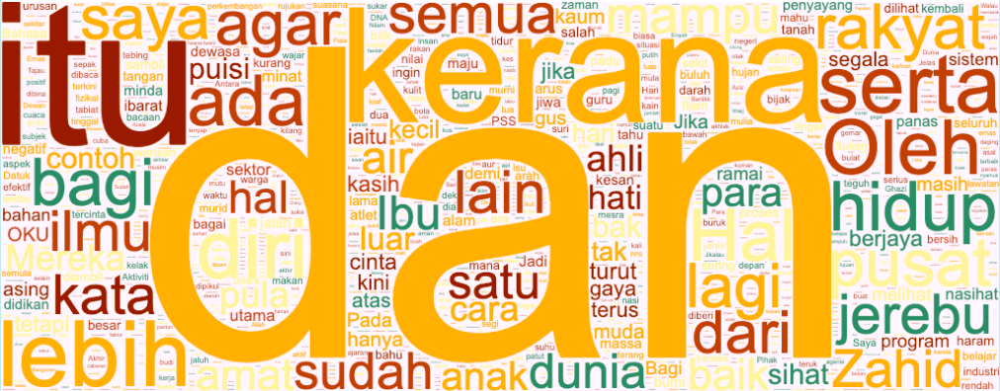

<p align="center">
    <a href="#readme">
        
    </a>
</p>
<p align="center">
  <a href="https://github.com/huseinzol05/Malaya-Dataset/blob/master/LICENSE"></a>
</p>

---

**Malaya-Dataset**, We gather Bahasa Malaysia corpus! This repository to store corpus for [Malaya](https://github.com/huseinzol05/Malaya) and [Bahasa-NLP-Tensorflow](https://github.com/huseinzol05/Bahasa-NLP-Tensorflow). We will keep update this repository overtime.

## How we gather these corpus?

1. For news, articles and subtitles, we use crawler, you can get the code from here, [Malaya/crawler](https://github.com/huseinzol05/Malaya/tree/master/crawl)
2. For Bahasa, mostly we use Google Translator, you can get the code from here, [Malaya/translator](https://github.com/huseinzol05/Malaya/tree/master/translator)
3. Using social media, I catch most of live data from Twitter, Facebook and Instagram using crawlers, So I just search using Elasticsearch query.
4. For speech, we recorded using wired microphone attached to Macbook Air.
5. We pay some linguists.

## Table of contents
  * [Dictionary](https://github.com/huseinzol05/Malaya-Dataset#dictionary)
    * [73k English-Malay](https://github.com/huseinzol05/Malaya-Dataset#73k-english-malay)
    * [200k English-Malay](https://github.com/huseinzol05/Malaya-Dataset#200k-english-malay)
    * [90k synonym](https://github.com/huseinzol05/Malaya-Dataset#90k-synonym)
    * [Dictionary, 24550 unique words](https://github.com/huseinzol05/Malaya-Dataset#dictionary-24550-unique-words)
    * [Ngrams](https://github.com/huseinzol05/Malaya-Dataset#ngrams)
  * [Tagging](https://github.com/huseinzol05/Malaya-Dataset#tagging)
    * [Dependency](https://github.com/huseinzol05/Malaya-Dataset#dependency)
    * [Part of Speech](https://github.com/huseinzol05/Malaya-Dataset#part-of-speech)
    * [Entities](https://github.com/huseinzol05/Malaya-Dataset#entities-json)
  * [Sentiment](https://github.com/huseinzol05/Malaya-Dataset#sentiment)
    * [sentiment News](https://github.com/huseinzol05/Malaya-Dataset#sentiment-news)
    * [sentiment Twitter](https://github.com/huseinzol05/Malaya-Dataset#sentiment-twitter)
    * [sentiment Multidomain](https://github.com/huseinzol05/Malaya-Dataset#sentiment-multidomain)
    * [Polarity](https://github.com/huseinzol05/Malaya-Dataset#polarity)
  * [Corpus](https://github.com/huseinzol05/Malaya-Dataset#corpus)
    * [Audience Nationality](https://github.com/huseinzol05/Malaya-Dataset#audience-nationality)
    * [Emotion](https://github.com/huseinzol05/Malaya-Dataset#emotion)
    * [Gender](https://github.com/huseinzol05/Malaya-Dataset#gender)
    * [Insincere question](https://github.com/huseinzol05/Malaya-Dataset#insincere-question)
    * [Irony](https://github.com/huseinzol05/Malaya-Dataset#irony)
    * [Language Detection, Wikipedia](https://github.com/huseinzol05/Malaya-Dataset#language-detection-wikipedia)
    * [Malaysia Entities](https://github.com/huseinzol05/Malaya-Dataset#malaysia-entities)
    * [Malaysia Topics](https://github.com/huseinzol05/Malaya-Dataset#malaysia-topics)
    * [Political landscape](https://github.com/huseinzol05/Malaya-Dataset#political-landscape)
    * [Sarcastic news-headline](https://github.com/huseinzol05/Malaya-Dataset#sarcastic-news-headline)
    * [Subjectivity](https://github.com/huseinzol05/Malaya-Dataset#subjectivity)
    * [Toxicity](https://github.com/huseinzol05/Malaya-Dataset#toxicity)
  * [News](https://github.com/huseinzol05/Malaya-Dataset#news)
    * [Fake News](https://github.com/huseinzol05/Malaya-Dataset#fake-news)
    * [News, crawled](https://github.com/huseinzol05/Malaya-Dataset#news-crawled)
    * [30k News](https://github.com/huseinzol05/Malaya-Dataset#30k-news)
    * [Articles](https://github.com/huseinzol05/Malaya-Dataset#articles)
  * [Speech](https://github.com/huseinzol05/Malaya-Dataset#speech)
  * [English-Malay translation](https://github.com/huseinzol05/Malaya-Dataset#english-malay-translation)
  * [Question-Answer](https://github.com/huseinzol05/Malaya-Dataset#question-answer)
    * [General](https://github.com/huseinzol05/Malaya-Dataset#general)
    * [SQUAD](https://github.com/huseinzol05/Malaya-Dataset#squad)
  * [Normalization](https://github.com/huseinzol05/Malaya-Dataset#normalization)
    * [Normalize](https://github.com/huseinzol05/Malaya-Dataset#normalize)
    * [Stemmer](https://github.com/huseinzol05/Malaya-Dataset#stemmer)
  * [Text-similarity](https://github.com/huseinzol05/Malaya-Dataset#text-similarity)
  * [Dumping](https://github.com/huseinzol05/Malaya-Dataset#dumping)
    * [Karangan sekolah](https://github.com/huseinzol05/Malaya-Dataset#karangan-sekolah)
    * [Multidomain](https://github.com/huseinzol05/Malaya-Dataset#multidomain)
    * [Subtitle](https://github.com/huseinzol05/Malaya-Dataset#subtitle)
  * [Suggestion](https://github.com/huseinzol05/Malaya-Dataset#suggestion)
  * [Citation](https://github.com/huseinzol05/Malaya-Dataset#citation)
  * [Donation](https://github.com/huseinzol05/Malaya-Dataset#donation)

## Dictionary

**_Not an official released from Dewan Bahasa._**

#### 73k English-Malay

Total size: 1.1 MB

Originally posted by Facebook, https://dl.fbaipublicfiles.com/arrival/dictionaries/en-ms.txt

#### [200k English-Malay](200k-english-malay)

Total size: 6.9 MB

#### [90k synonym](synonym)

Total size: 4.7 MB    

#### [Dictionary, 24550 unique words](dictionary)

Total size: 428 KB

#### [Ngrams](ngram)

Total size: 92 MB

Unigram and Bigram collected from news, structure,
```python
{'saya': 1000}
```

## Tagging

#### [Dependency](dependency)

Total size: 24.1 MB

#### [Part-of-Speech](part-of-speech)

Total size: 3.1 MB

1. ADJ - Adjective, kata sifat
2. ADP - Adposition
3. ADV - Adverb, kata keterangan
4. ADX - Auxiliary verb, kata kerja tambahan
5. CCONJ - Coordinating conjuction, kata hubung
6. DET - Determiner, kata penentu
7. NOUN - Noun, kata nama
8. NUM - Number, nombor
9. PART - Particle
10. PRON - Pronoun, kata ganti
11. PROPN - Proper noun, kata ganti nama khas
12. SCONJ - Subordinating conjunction
13. SYM - Symbol
14. VERB - Verb, kata kerja
15. X - Other

#### [Entities, JSON](entities)

Total size: 5.2 MB

1. OTHER - Other
2. law - law, regulation, related law documents, documents, etc
3. location - location, place
4. organization - organization, company, government, facilities, etc
5. person - person, group of people, believes, etc
6. quantity - numbers, quantity
7. time - date, day, time, etc
8. event - unique event happened, etc

## Sentiment

#### [Sentiment News](news-sentiment)

Total size: 496 KB

1. Positive
2. Negative

#### [Sentiment Twitter](twitter-sentiment)

Total size: 50.6 MB

1. Positive
2. Negative

#### [Sentiment Multidomain](multidomain-sentiment)

Total size: 159 KB

1. Amazon review, Positive and Negative
2. IMDB review, Positive and Negative
3. Yelp review, Positive and Negative

#### [Polarity](polarity)

Total size: 1.3 MB

1. Positive
2. Negative

## Corpus

#### [Audience Nationality](audience)

Total size: 246 KB

1. constituency
2. national

#### [Emotion](emotion)

Total size: 41.2 MB

1. Anger
2. Fear
3. Joy
4. Love
5. Sadness
6. Surprise

#### [Gender](gender)

Total size: 2.2 MB

1. Unknown
2. Male
3. Female
4. Brand

#### [Insincere question](insincere-question)

Total size: 60.4 MB

1. Negative
2. Positive

#### [Irony](irony)

Total size: 465 KB

1. Positive
2. Negative

#### [Language-detection, Wikipedia](language-detection)

Total size: 26.2 MB
```python
(array(['OTHER', 'ara', 'ber', 'bul', 'ces', 'cmn', 'dan', 'deu', 'ell',
        'eng', 'epo', 'fin', 'fra', 'heb', 'hun', 'ind', 'ita', 'jpn',
        'kor', 'lat', 'lit', 'mar', 'mkd', 'nld', 'pol', 'por', 'rus',
        'spa', 'srp', 'swe', 'toki', 'tur', 'ukr', 'zlm'], dtype='<U5'),
 array([37910, 10000, 10000, 10000, 10000, 10000, 10000, 10000, 10000,
        50000, 10000, 10000, 10000, 10000, 10000, 57327, 10000, 10000,
         3687, 10000, 10000, 10000, 10000, 10000, 10000, 10000, 10000,
        10000, 10000, 10000, 10000, 10000, 10000, 53692]))
```

#### [Malaysia-entities](malaysia-entities)

Social media texts related to Malaysia entities.

Total size: 190.1 MB

<details><summary>Complete list (210 entities)</summary>

1. mahathir
2. anwar ibrahim
3. najib razak
4. pakatan harapan
5. syed saddiq
6. parti keadilan rakyat
7. umno
8. barisan nasional
9. parti islam semalaysia
10. nurul izzah
11. tunku ismail idris
12. mca
13. democratic action party
14. parti amanah
15. ppbm
16. mic
17. tun daim zainuddin
18. datuk seri abdul hadi awang
19. majlis pakatan harapan
20. wan azizah
21. parti pribumi bersatu malaysia
22. datuk seri azmin ali
23. datuk johari abdul
24. tengku razaleigh hamzah
25. tan sri dr rais yatim
26. rafizi ramli
27. bersatu
28. bernama
29. donald trump
30. perkasa
31. tan sri mokhzani mahathir
32. rais yatim
33. anthony loke siew fook
34. rosmah mansur
35. arul kanda
36. zeti aziz
37. robert kuok
38. hassan merican
39. ks jomo
40. jho low
41. kadir jasin
42. zakir naik
43. bung mokhtar
44. shafie apdal
45. ariff md yusof
46. felda
47. dato vida
48. jabatan perancangan bandar desa
49. jabatan perdana menteri malaysia
50. kementerian kewangan malaysia
51. kementerian dalam negeri malaysia
52. kementerian perdagangan dalam negeri hal ehwal pengguna malaysia
53. kementerian luar negeri malaysia
54. kementerian pertahanan malaysia
55. kementerian pendidikan malaysia
56. kementerian pembangunan luar bandar
57. kementerian kerja raya malaysia
58. kementerian kesihatan malaysia
59. kementerian komunikasi multimedia malaysia
60. kementerian perumahan kerajaan tempatan malaysia
61. kementerian pelancongan kebudayaan malaysia
62. kementerian pengangkutan malaysia
63. kementerian pembangunan wanita keluarga masyarakat malaysia
64. kementerian pertanian industri asas tani
65. kementerian perusahaan perladangan komoditi
66. kementerian perdagangan antarabangsa industri
67. kementerian sains teknologi inovasi malaysia
68. kementerian sumber manusia malaysia
69. kementerian sumber asli alam sekitar malaysia
70. kementerian wilayah persekutuan malaysia
71. kementerian tenaga teknologi hijau air malaysia
72. jabatan perkhidmatan awam malaysia
73. jabatan kemajuan islam (jakim) department of islamic development
74. jabatan parlimen malaysia
75. agensi kelayakan malaysia
76. agensi penguatkuasaan maritim malaysia
77. bahagian istiadat urusetia persidangan antarabangsa
78. bahagian hal ehwal undang-undang
79. bahagian kabinet perlembangan perhubungan antara kerajaan
80. bahagian kemajuan wilayah persekutuan perancangan lembah klang
81. bahagian keselamatan negara
82. bahagian pengurusan hartanah
83. bahagian pengurusan perkhidmatan sumber manusia
84. bahagian penyelidikan
85. biro bantuan guaman
86. biro pengaduan awam
87. biro tatanegara
88. istana negara
89. institut kefahaman islam malaysia
90. institut latihan kehakiman perundangan
91. pejabat ketua setiausaha negara
92. pejabat perdana menteri
93. jabatan peguam negara
94. majlis agama islam wilayah persekutuan
95. masjid negara
96. pejabat ketua pegawai keselamatan kerajaan malaysia
97. pejabat setiausaha persekutuan sabah
98. perpustakaan kuala lumpur
99. pejabat setiausaha persekutuan sarawak
100. lembaga tabung haji
101. penasihat sains
102. jabatan audit negara malaysia
103. jabatan pertahanan awam malaysia
104. suruhanjaya pengankutan awam darat
105. perbendaharaan malaysia
106. majlis tindakan ekonomik negara
107. jabatan perangkaan (jp) department of statistics
108. polis diraja malaysia
109. ikatan relawan rakyat malaysia
110. jabatan penjara malaysia
111. jabatan pendaftaran negara malaysia
112. lembaga penapisan filem
113. jabatan imigresen malaysia
114. suruhanjaya syarikat malaysia
115. suruhanjaya koperasi malaysia
116. perbadanan harta intelek malaysia
117. bank kerjasama rakyat malaysia
118. perbadanan nasional berhad
119. maktab koperasi malaysia
120. suruhanjaya persaingan malaysia
121. institut diplomasi hal ehwal luar negeri
122. angkatan tentera malaysia
123. tentera darat malaysia
124. tentera udara diraja malaysia
125. tentera laut diraja malaysia
126. program latihan khidmat negara
127. dewan bahasa pustaka
128. institut pendidikan guru malaysia
129. perbadanan tabung pendidikan tinggi nasional
130. institut terjemahan negara malaysia
131. kejora
132. felcra
133. risda
134. jabatan kerja raya malaysia
135. lembaga lebuhraya malaysia
136. lembaga jurutera malaysia
137. lembaga pembangunan industri pembinaan
138. institut jantung negara
139. klinik 1malaysia
140. insitut kanser negara
141. radio televisyen malaysia
142. suruhanjaya komunikasi multimedia malaysia
143. jabatan penerangan malaysia
144. jabatan perancangan bandar desa semenanjung malaysia
145. jabatan bomba penyelamat malaysia
146. jabatan perumahan negara
147. jabatan kerajaan tempatan
148. jabatan landskap negara
149. jabatan pengurusan sisa pepejal negara
150. tribunal perumahan pengurusan strata
151. perbadanan pengurusan sisa pepejal pembersihan awam
152. jabatan pelancongan malaysia
153. jabatan pengangkutan jalan
154. jabatan penerbangan awam
155. lembaga pelabuhan klang
156. jabatan laut malaysia
157. jabatan keselamatan jalan raya
158. lembaga pelabuhan kuantan
159. lembaga pelabuhan johor
160. lembaga pelabuhan pulau pinang
161. jabatan kebajikan masyarakat malaysia
162. institut penyelidikan kemajuan pertanian malaysia
163. lembaga kemajuan ikan malaysia
164. lembaga pemasaran pertanian persekutuan
165. jabatan pertanian malaysia
166. lembaga pertubuhan peladang
167. lembaga kemajuan pertanian kemubu
168. lembaga kemajuan pertanian muda
169. jabatan perikanan
170. jabatan perkhidmatan veterinar
171. lembaga perindustrian nanas malaysia
172. tabung ekonomi kumpulan usaha niaga
173. bank pertanian
174. lembaga minyak sawit malaysia
175. lembaga pembangunan pelaburan malaysia
176. agensi nuklear malaysia
177. institut penyelidikan teknologi nuklear malaysia
178. pusat sains negara
179. jabatan kimia malaysia
180. jabatan meteorologi malaysia
181. jabatan perkhidmatan awam
182. institut tadbiran awam negara
183. jabatan agama islam wilayah persekutuan
184. jabatan tenaga kerja semenanjung malaysia
185. jabatan alam sekitar
186. jabatan pengairan saliran
187. jabatan tanah galian wilayah persekutuan
188. jabatan perlindungan hidupan liar taman negara
189. dewan bandaraya kuala lumpur
190. perbadanan putrajaya
191. perbadanan labuan
192. jabatan bekalan air
193. jabatan perkhidmatan pembetungan
194. suruhanjaya tenaga
195. suruhanjaya perkhidmatan air negara
196. malaysian green technology corporation
197. yayasan hijau malaysia
198. mahkamah persekutuan
199. mahkamah syariah wilayah persekutuan
200. suruhanjaya perdagangan komoditi
201. suruhanjaya perkhidmatan awam
202. suruhanjaya perkhidmatan pendidikan
203. suruhanjaya pilihan raya
204. suruhanjaya pencegahan rasuah malaysia
205. tribunal perkhidmatan awam
206. unit khas teknologi tinggi
207. unit pemodenan tadbiran perancangan pengurusan malaysia
208. unit perancang ekonomi
209. unit penyelarasan pelaksanaan
210. urusetia persidangan antarabangsa protokol

</details>

#### [Malaysia Topics](malaysia-topics)

Social media texts related to Malaysia topics.

Total size: 322.4 MB

<details><summary>Complete list (249 topics)</summary>

1. ganja
2. orang asli
3. kaum cina
4. k-pop
5. kaum india
6. pos laju
7. hari raya aidilfitri
8. hari raya aidiladha
9. syarikat permulaan
10. isu tanah
11. kaum melayu
12. facebook
13. keluar parti
14. sabotaj parti
15. kotak undi
16. humanoid
17. kemalangan penumpang cedera
18. kemalangan maut
19. individu penjara
20. kes rogol
21. kes cabul
22. kes rompakan
23. kes ragut
24. cambridge analytica
25. kokain
26. bebas tahanan
27. sosial media
28. twitter
29. instagram
30. mati dipukul
31. pengedar dadah
32. kematian wabak
33. letupan bom
34. isu dadah
35. isu bmf
36. isu diesel
37. isu china
38. isu saudi arabia
39. unifi
40. piala thomas
41. fifa
42. bahasa pengaturcaraan
43. baling botol
44. perkahwinan kanak-kanak
45. produk berbahaya
46. musim durian
47. world cup
48. motogp
49. euro 2020
50. ask me a question
51. thai cave
52. racist
53. bola sepak
54. hockey
55. sepak takraw
56. reformasi
57. deepavali
58. chinese new year
59. lazada sells
60. shopee sells
61. e-sport
62. valve corporation
63. dota2
64. counter strike global-offensive
65. asean football organization
66. blackpink
67. kecurian kereta
68. kecurian motosikal
69. youtube rewind
70. pewdiepie
71. isu tiket
72. kuota haji
73. tsunami
74. kes lemas
75. kes buang bayi
76. kes pecah rumah
77. paedophilia
78. kes luar nikah
79. kes tangkap basah
80. kes bawah umur
81. pdrm
82. 1mdb
83. gst
84. sst
85. tiga penjuru
86. pilihan raya umum
87. pilihan raya kecil
88. pusat daerah mangundi
89. masalah air
90. rumah mampu milik
91. pendidikan
92. sekolah
93. universiti
94. maktab rendah sains mara
95. kesihatan
96. hutang negara
97. ekonomi
98. sosial
99. menteri besar kedah
100. menteri besar perak
101. menteri besar perlis
102. menteri besar selangor
103. menteri besar johor
104. menteri besar kelantan
105. menteri besar terengganu
106. menteri besar negeri sembilan
107. felda
108. kwsp
109. sosco
110. bank malaysia
111. bank negara
112. perdana menteri
113. timbalan perdana menteri
114. menteri dalam negeri
115. menteri kewangan
116. menteri pertahanan
117. menteri belia dan sukan
118. majlis penasihat
119. skim peduli sihat
120. ptptn
121. projek mega
122. gaji minimum
123. menyiasat skandal
124. highway tol
125. tabung haji
126. tentera malaysia
127. infrastruktur
128. kos sara hidup
129. pengangkutan awam
130. perkhidmatan awam
131. isu wanita
132. survei institut darul ehsan
133. inisiatif peduli rakyat
134. teknologi
135. internet
136. kecerdasan buatan
137. ahli dewan undangan negeri
138. suruhanjaya pilihan raya malaysia
139. kertas undi
140. akta pilihan raya
141. undi pos
142. undi rosak
143. harga minyak
144. petrol
145. subsidi kerajaan
146. mh370
147. gaji menteri
148. jabatan bubar
149. telekom malaysia
150. agama
151. lgbt
152. agama islam
153. masyarakat
154. liberalisme
155. kapitalisme
156. idealogi
157. parlimen
158. pusat transformasi bandar
159. institut diraja
160. tsunami fitnah
161. makro-ekonomi
162. mikro-ekonomi
163. pasaran saham malaysia
164. pendapatan negara
165. nilai ringgit jatuh
166. gaji median
167. bursa malaysia
168. malaysia baru
169. keluar parlimen
170. dewan rakyat
171. tabung harapan
172. isu singapura
173. isu rohingya
174. isu syria
175. malaysia-indonesia
176. isu gaza
177. isu palestin
178. isu yaman
179. harimau malaya
180. isu kuil
181. isu lynas
182. isu masjid
183. isu sosma
184. isu ecrl
185. royalti minyak
186. kes rasuah
187. kewangan dan perniagaan
188. saham dan komoditi
189. isu kerugian
190. bumiputera
191. alam sekitar
192. isu kemiskinan
193. sumber asli
194. pertanian malaysia
195. pertanian durian
196. pertanian padi
197. pertanian getah
198. pertanian kelapa sawit
199. pertanian pisang
200. pertanian nenas
201. akuakultur malaysia
202. hortikultur malaysia
203. icerd
204. yang di-pertuan agong
205. perlembagaan malaysia
206. malaysia airlines
207. malaysia airport
208. kuala lumpur international airport
209. malacca airport
210. bintulu airport
211. kota kinabalu airport
212. kuching airport
213. labuan airport
214. lahad datu airport
215. langkawi airport
216. limbang airport
217. miri airport
218. penang airport
219. sandakan airport
220. sibu airport
221. sultan abdul halim airport
222. sultan haji ahmad shah airport
223. sultan azlan shah airport
224. sultan ismail petra airport
225. sultan mahmud airport
226. tawau airport
227. tioman airport
228. anggota bomba
229. angkatan tentera darat
230. angkatan tentera laut
231. angkatan tentera udara
232. anggota ambulans
233. anggota polis
234. perkhidmatan kehakiman
235. perkhidmatan am persekutuan
236. industri 4.0
237. kumpulan pengganas tempatan
238. kumpulan pengganas asing
239. sultan selangor
240. sultan kedah
241. sultan kelantan
242. sultan perlis
243. sultan johor
244. sultan negeri sembilan
245. sultan terengganu
246. pemilihan agong
247. isu plastik
248. gejala sosial
249. isytihar darurat

</details>

#### [Sarcastic news-headline](sarcastic-news-headline)

Total size: 1.78 MB

1. Positive
2. Negative

#### [Subjectivity](subjectivity)

Total size: 1.4 MB

1. Positive
2. Negative

#### [Toxicity](toxicity)

Total size: 70 MB

Toxicity is multilabel, prefer to use sigmoid based.

1. toxic
2. severe toxic
3. obscene
4. threat
5. insult
6. identity hate

#### [Political landscape](political-landscape)

Total size: 2 MB

1. Kerajaan
2. Pembangkang

## News

#### [Fake News](fake-news)

Total size: 122.2 MB

1. Negative
2. Positive

Malaysia fake news, contributed by [syazanihussin](https://github.com/syazanihussin/FLUX/tree/master/data)

#### [30k News](news-30k)

Total size: 66.6 MB

Crawled on Google news using these keywords,

```python
strings = [
    'bank negara OR kewangan malaysia OR kementerian kewangan',
    'mata wang malaysia OR bon malaysia OR saham malaysia',
    'perdagangan malaysia OR ekonomi malaysia OR sosial malaysia',
    'kementerian malaysia',
    'kaum melayu OR kaum cina',
    'stock market malaysia OR saham malaysia',
    'malaysia parliament OR parlimen malaysia',
    'asia OR asean',
    'malaysia property OR hartanah malaysia',
    'artis OR wanita',
    'pendidikan OR kesihatan OR infrastruktur'
    'dr mahathir OR wan zizah OR lim guan eng OR muhyiddin OR mohamad sabu OR azmin ali',
    'umno OR pkr OR mic OR barisan nasional OR parti amanah OR dap',
    'isu kerajaan OR isu pembangkang',
    'politik OR malaysia OR dunia OR bisnes',
    'sukan OR hiburan OR teknologi OR gaya hidup OR automotif'
    'johor OR kedah OR kelantan OR melaka',
    'negeri sembilan OR pahang OR pulau pinang OR perak',
    'perlis OR sabah OR sarawak OR selangor',
    'terengganu OR kuala lumpur OR labuan OR putrajaya',
]
```

#### [News, crawled](news)

Total size: 16.6 MB

<details><summary>Complete list (117 news)</summary>

1. astro awani
2. bahasa pengaturcaraan
3. berjaya group
4. bisnes malaysia
5. bumiputera
6. cuti sekolah
7. ekonomi
8. felda
9. gaya hidup
10. harga tiket
11. isu 1mdb
12. isu agama
13. isu agong
14. isu agrikultur
15. isu air
16. isu airasia
17. isu ambank
18. isu anwar ibrahim
19. isu artis
20. isu astro
21. isu axiata
22. isu bahasa melayu
23. isu barisan nasional
24. isu bisnes
25. isu celcom
26. isu cikgu
27. isu cimb
28. isu cukai
29. isu cyberjaya
30. isu dadah
31. isu dahmakan
32. isu dunia
33. isu grab
34. isu gst
35. isu harakah
36. isu harga
37. isu icerd
38. isu imigren
39. isu kahwin
40. isu kapitalis
41. isu kerajaan
42. isu kesihatan
43. isu kuala lumpur
44. isu lgbt
45. isu mahathir
46. isu makanan
47. isu malaysia airlines
48. isu malaysia
49. isu maxis
50. isu minyak
51. isu najib razak
52. isu pas
53. isu pelajar
54. isu pelakon
55. isu pembangkang
56. isu perkauman
57. isu permainan
58. isu pertanian
59. isu pkr
60. isu politik
61. isu rosmah
62. isu sabah
63. isu sarawak
64. isu sekolah
65. isu selangor
66. isu semasa
67. isu singapore
68. isu sosial media
69. isu spotify
70. isu sukan
71. isu sultan melayu
72. isu tanah
73. isu teknologi
74. isu terkini
75. isu tm
76. isu ubat
77. isu umno
78. isu universiti
79. isu wan azizah
80. johor corporation
81. johor
82. kaum cina
83. kaum india
84. kelantan
85. kes remaja
86. kes rogol
87. kesihatan
88. khazanah nasional
89. kolej
90. kotak undi
91. lompat parti
92. malaysia airlines
93. melaka
94. modenas
95. mydin
96. negeri sembilan
97. orang asli
98. parti amanah
99. peluang pekerjaan
100. pengedar dadah
101. perkahwinan
102. perlis
103. perodua
104. petronas
105. pos laju
106. produk berbahaya
107. sabah
108. sarawak
109. selangor
110. sukan malaysia
111. sunway group
112. tabung haji
113. tadika
114. teknologi malaysia
115. tenaga nasional
116. terengganu
117. universiti

</details>

#### [Articles](articles)

Total size: 3.1 MB

1. Filem
2. Kerajaan
3. Pembelajaran
4. Pendidikan
5. Sekolah

## [Speech](speech)

Total size: 276 MB

## [English-Malay translation](english-malay)

Total size: 91.2 MB

## Question-Answer

#### [General](question-answer)

Total size: 2.5 MB

```
1 mary pergi ke taman. 2 mary pergi ke dapur. 3 husein kembali ke pejabat.
4 husein perjalanan ke lorong. 5 jeff kembali ke bilik tidur. 6 fred berpindah ke lorong.
7 husein berpindah ke bilik mandi. 8 jeff kembali ke taman. 9 jeff kembali ke dapur.
10 fred kembali ke taman. 11 mary mendapat bola sepak di sana. 12 mary menyerahkan bola sepak kepada jeff.
13 apa yang mary berikan kepada jeff? <> bola sepak <> 12.
14 husein kembali ke lorong. 15 jeff kembali ke bilik tidur. 16 apa yang mary berikan kepada jeff? <> bola sepak <> 12.
17 fred berpindah ke bilik mandi. 18 mary mengambil susu di sana. 19 apa yang mary berikan kepada jeff? <> bola sepak <> 12.
20 fred pergi ke dapur. 21 mary menyerahkan susu itu kepada fred. 22 siapa yang memberikan susu itu kepada fred? <> mary <> 21.
23 fred berpindah ke lorong. 24 jeff pergi ke pejabat. 25 siapa yang mary memberikan susu itu? <> fred <> 21
```

#### [SQUAD](squad-question-answer)

[SQUAD (Stanford Question Answering Dataset)](https://rajpurkar.github.io/SQuAD-explorer/) allows to translate to different language, [stated here](https://groups.google.com/forum/#!searchin/squad-stanford-qa/translate%7Csort:date/squad-stanford-qa/tLNlhhMZIFM/x9il9aF2CgAJ), and distributed under the [CC BY-SA 4.0 license](http://creativecommons.org/licenses/by-sa/4.0/legalcode).

## Normalization

#### [Normalize](normalize)

Total size: 2.6 MB

#### [Stemmer](stemmer)

Total size: 6.5 MB

1. News stemming
2. Wikipedia stemming

## [Text similarity](text-similarity)

Total size: 60.8 MB

1. Quora

Translated from [First Quora Dataset Release: Question Pairs](https://data.quora.com/First-Quora-Dataset-Release-Question-Pairs), protected by [Terms of Service](https://www.quora.com/about/tos), allowing for non-commercial use.

## Dumping

#### [Karangan sekolah](karangan-sekolah)

Total size: 221 KB

#### Multidomain

1. Wikipedia,

Total size: 240.2 MB, 1663373 sentences, [download link](https://huseinhouse-storage.s3-ap-southeast-1.amazonaws.com/bert-bahasa/dumping-wiki-6-july-2019.json).

2. Instagram,

Total size: 418.2 MB, 695571 sentences, [download link](https://huseinhouse-storage.s3-ap-southeast-1.amazonaws.com/bert-bahasa/dumping-instagram-6-july-2019.json).

3. Twitter,

Total size: 577.5 MB, 10172726 sentences, [download link](https://huseinhouse-storage.s3-ap-southeast-1.amazonaws.com/bert-bahasa/dumping-twitter-6-july-2019.json).

4. Public news,

Total size: 57.7 MB, 399251 sentences, [download link](https://huseinhouse-storage.s3-ap-southeast-1.amazonaws.com/bert-bahasa/dumping-news-6-july-2019.json).

#### [Subtitle](subtitle)

Total size: 1.5 MB

## Suggestion

1. Always apply text augmentation, like swapping based words using synonyms or thesaurus. We gathered some synonyms if you want to use it, [90k synonyms](synonym).
2. Malaya also provided interface for text augmentation using word2vec, [Malaya-text-augmentation](https://malaya.readthedocs.io/en/latest/Generator.html#text-augmentation)
3. Feel free to contact me to request new dataset.

## Citation

1. Please citate the repository if use these corpus.

```
@misc{Malaya-Dataset, We gather Bahasa Malaysia corpus! This repository to store corpus for Malaya,
  author = {Husein, Zolkepli},
  title = {Malaya-Dataset},
  year = {2018},
  publisher = {GitHub},
  journal = {GitHub repository},
  howpublished = {\url{https://github.com/huseinzol05/Malaya-Dataset}}
}
```

2. Please at least email us first before distributing these data. Remember all these hard workings we want to give it for free.
3. What do you see just the data, but nobody can see how much we spent our cost to make it public.

## Donation

<a href="https://www.patreon.com/bePatron?u=7291337"></a>

Or, One time donation without credit card hustle, **7053174643, CIMB Bank, Husein Zolkepli**
